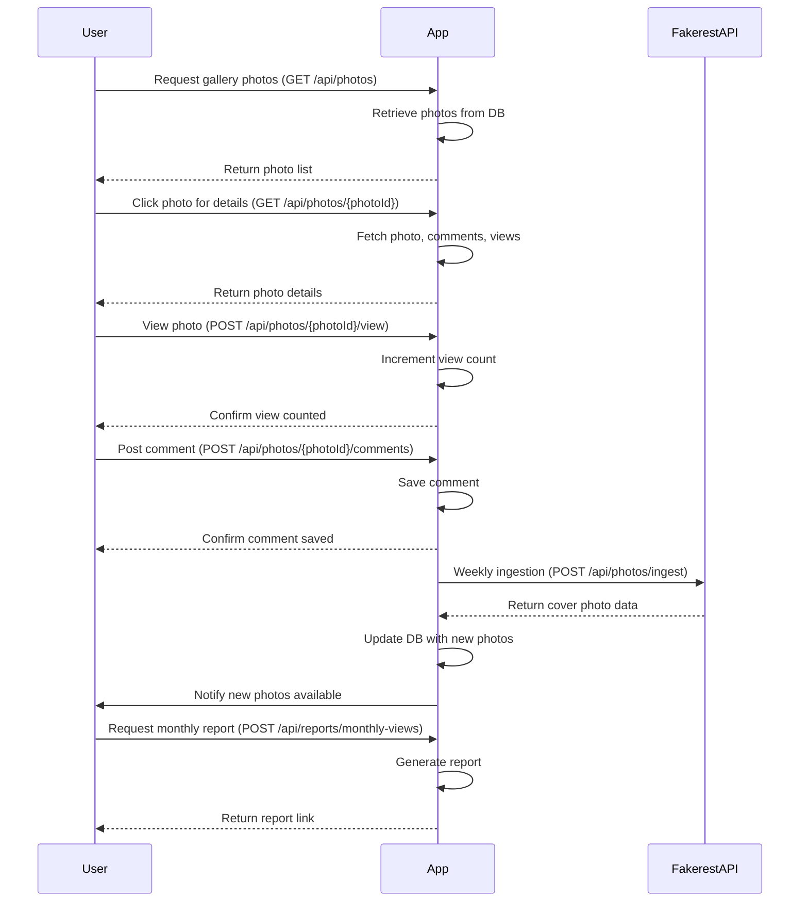
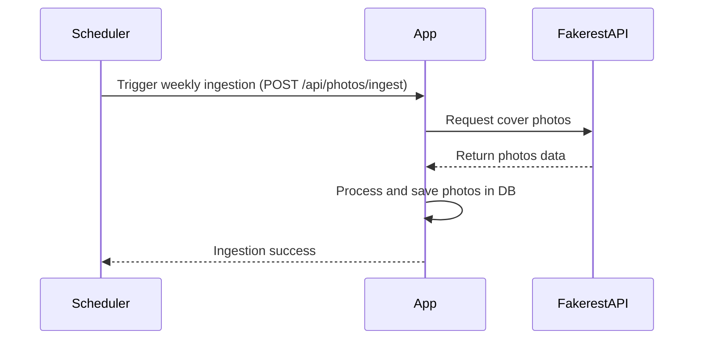

```markdown
# Functional Requirements and API Design for Cover Photo Gallery Application

## Overview
The application will:
- Ingest cover photo data from Fakerest API weekly (via POST endpoint).
- Display cover photos and related data (via GET endpoints).
- Allow users to view photos in detail and leave comments.
- Track photo views.
- Generate monthly reports on most viewed photos.
- Notify users about new cover photos.

---

## API Endpoints

### 1. Data Ingestion  
**POST /api/photos/ingest**  
- Triggers ingestion of cover photos from Fakerest API (scheduled weekly).  
- **Request:** Empty or with optional params for ingestion control.  
- **Response:**  
```json
{
  "status": "success",
  "ingestedCount": 50
}
```

---

### 2. Get Gallery Photos  
**GET /api/photos**  
- Returns list of cover photos for gallery display.  
- **Request:** Query params for pagination (e.g., `?page=1&size=20`)  
- **Response:**  
```json
{
  "photos": [
    {
      "id": "string",
      "title": "string",
      "thumbnailUrl": "string"
    }
  ],
  "page": 1,
  "size": 20,
  "total": 100
}
```

---

### 3. Get Photo Details  
**GET /api/photos/{photoId}**  
- Returns detailed info of a cover photo including comments and view count.  
- **Response:**  
```json
{
  "id": "string",
  "title": "string",
  "imageUrl": "string",
  "description": "string",
  "viewCount": 123,
  "comments": [
    {
      "id": "string",
      "user": "string",
      "comment": "string",
      "timestamp": "ISO8601 string"
    }
  ]
}
```

---

### 4. Post a Comment  
**POST /api/photos/{photoId}/comments**  
- Adds a user comment to a photo.  
- **Request:**  
```json
{
  "user": "string",
  "comment": "string"
}
```  
- **Response:**  
```json
{
  "status": "success",
  "commentId": "string"
}
```

---

### 5. Increment Photo View Count  
**POST /api/photos/{photoId}/view**  
- Registers a view for a photo (increments view count).  
- **Request:** Empty.  
- **Response:**  
```json
{
  "status": "success",
  "newViewCount": 124
}
```

---

### 6. Generate Monthly Report  
**POST /api/reports/monthly-views**  
- Generates report of most viewed photos for the month.  
- **Request:**  
```json
{
  "month": "YYYY-MM"
}
```  
- **Response:**  
```json
{
  "reportUrl": "string (link to generated PDF/CSV)"
}
```

---

### 7. Get Notifications  
**GET /api/notifications**  
- Returns notifications for the user about new cover photos.  
- **Response:**  
```json
{
  "notifications": [
    {
      "id": "string",
      "message": "string",
      "timestamp": "ISO8601 string",
      "read": false
    }
  ]
}
```

---

## User-App Interaction Sequence (Mermaid)



---

## Data Ingestion Workflow (Mermaid)



---
```