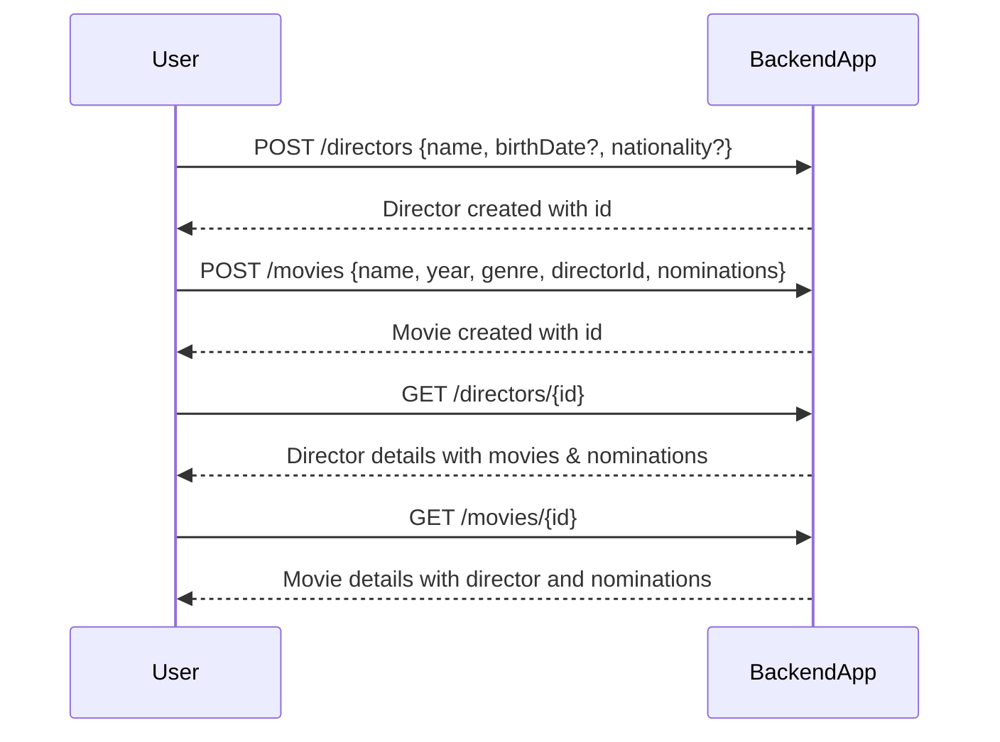

```markdown
# Functional Requirements & API Specification

## API Endpoints

### 1. Director Endpoints

- **Create Director**  
  `POST /directors`  
  **Request Body:**  
  ```json
  {
    "name": "string",
    "birthDate": "YYYY-MM-DD",  // optional
    "nationality": "string"      // optional
  }
  ```  
  **Response:**  
  ```json
  {
    "id": "uuid",
    "name": "string",
    "birthDate": "YYYY-MM-DD",
    "nationality": "string"
  }
  ```

- **Get Director by ID**  
  `GET /directors/{id}`  
  **Response:**  
  ```json
  {
    "id": "uuid",
    "name": "string",
    "birthDate": "YYYY-MM-DD",
    "nationality": "string",
    "movies": [
      {
        "id": "uuid",
        "name": "string",
        "year": 2022,
        "genre": "string",
        "nominations": [
          {
            "awardName": "string",
            "year": 2022
          }
        ]
      }
    ]
  }
  ```

### 2. Movie Endpoints

- **Create Movie with Nominations**  
  `POST /movies`  
  **Request Body:**  
  ```json
  {
    "name": "string",
    "year": 2022,
    "genre": "string",
    "directorId": "uuid",
    "nominations": [
      {
        "awardName": "string",
        "year": 2022
      }
    ]
  }
  ```  
  **Response:**  
  ```json
  {
    "id": "uuid",
    "name": "string",
    "year": 2022,
    "genre": "string",
    "directorId": "uuid",
    "nominations": [
      {
        "awardName": "string",
        "year": 2022
      }
    ]
  }
  ```

- **Get Movie by ID**  
  `GET /movies/{id}`  
  **Response:**  
  ```json
  {
    "id": "uuid",
    "name": "string",
    "year": 2022,
    "genre": "string",
    "director": {
      "id": "uuid",
      "name": "string"
    },
    "nominations": [
      {
        "awardName": "string",
        "year": 2022
      }
    ]
  }
  ```

---

## User-App Interaction Sequence Diagram



---

### Notes:
- POST endpoints handle creation and any external data processing.
- GET endpoints retrieve stored data only.
- Nominations are stored as structured objects with award name and year.
- Search functionality may be added later as a POST endpoint.

```

finish_discussion