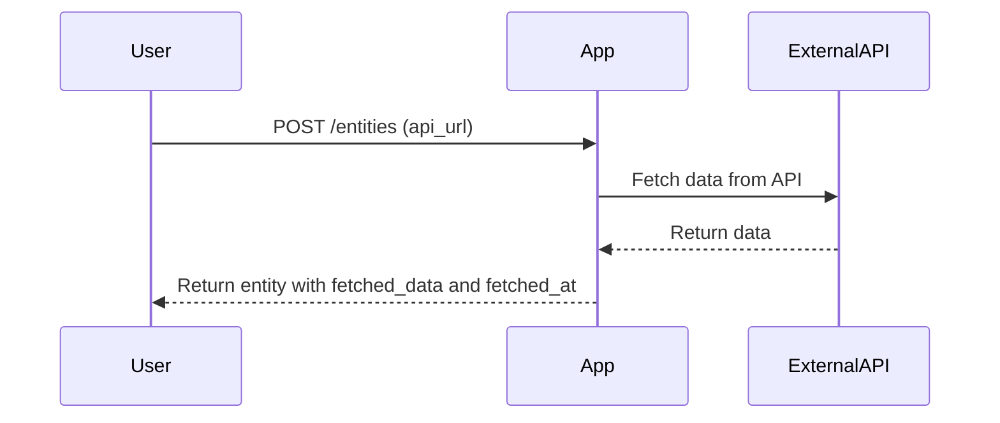
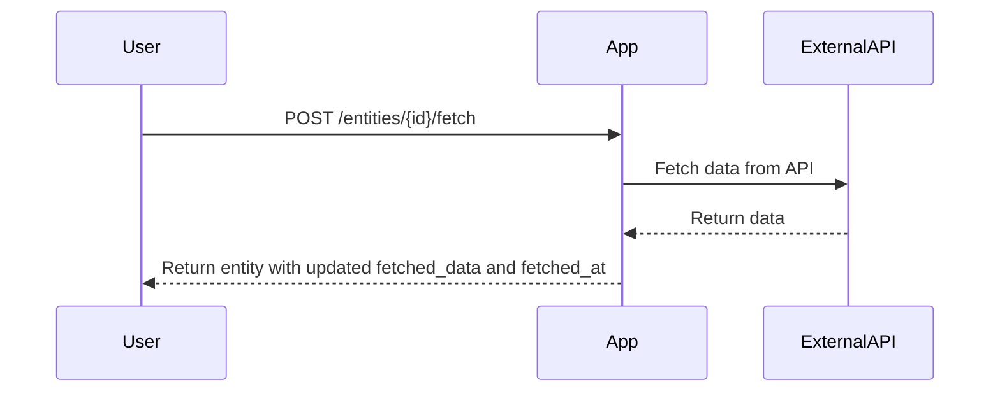
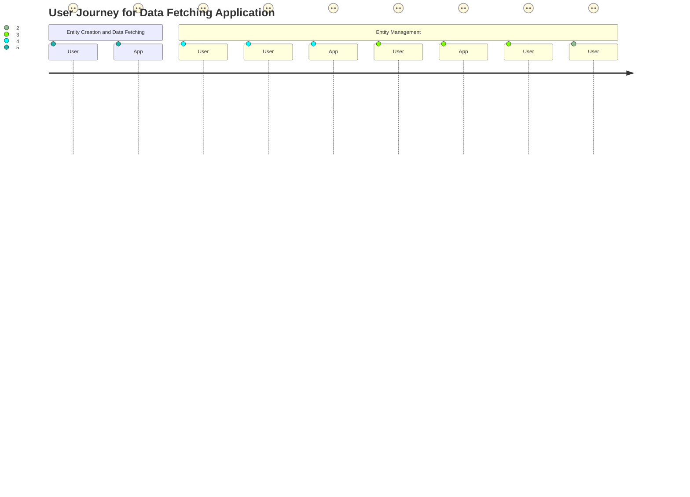

# Final Functional Requirements for Data Fetching Application

## API Endpoints

### 1. Create Entity
- **Endpoint**: `POST /entities`
- **Description**: Creates a new entity and triggers data fetching from the provided API URL.
- **Request Format**:
  ```json
  {
    "api_url": "string"
  }
  ```
- **Response Format**:
  ```json
  {
    "id": "string",
    "api_url": "string",
    "fetched_data": "object",
    "fetched_at": "string"
  }
  ```

### 2. Update Entity
- **Endpoint**: `POST /entities/{id}`
- **Description**: Updates an existing entity's API URL and triggers data fetching.
- **Request Format**:
  ```json
  {
    "api_url": "string"
  }
  ```
- **Response Format**:
  ```json
  {
    "id": "string",
    "api_url": "string",
    "fetched_data": "object",
    "fetched_at": "string"
  }
  ```

### 3. Manual Data Fetching
- **Endpoint**: `POST /entities/{id}/fetch`
- **Description**: Manually triggers data fetching for a specific entity.
- **Response Format**:
  ```json
  {
    "id": "string",
    "fetched_data": "object",
    "fetched_at": "string"
  }
  ```

### 4. Get All Entities
- **Endpoint**: `GET /entities`
- **Description**: Retrieves all entities.
- **Response Format**:
  ```json
  [
    {
      "id": "string",
      "api_url": "string",
      "fetched_data": "object",
      "fetched_at": "string"
    }
  ]
  ```

### 5. Delete Single Entity
- **Endpoint**: `DELETE /entities/{id}`
- **Description**: Deletes a specific entity.
- **Response Format**:
  ```json
  {
    "message": "Entity deleted successfully."
  }
  ```

### 6. Delete All Entities
- **Endpoint**: `DELETE /entities`
- **Description**: Deletes all entities.
- **Response Format**:
  ```json
  {
    "message": "All entities deleted successfully."
  }
  ```

## Visual Representation of User-App Interaction

### Entity Creation and Data Fetching Sequence



### Manual Data Fetching Sequence



### User Journey



These functional requirements and visual diagrams should provide a comprehensive understanding of the application's functionality and user interactions. If everything looks good, we can proceed further!