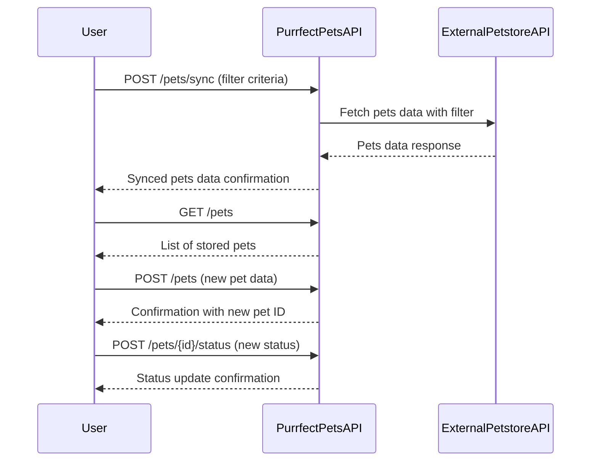

# Purrfect Pets API Functional Requirements

## API Endpoints

### 1. Add/Retrieve Pets Data from External Petstore API (POST)

- **Endpoint:** `/pets/sync`
- **Description:** Synchronizes and fetches pets data from the external Petstore API. This endpoint triggers the external API call and any necessary business logic (filtering, transformation).
- **Request Format:**  
  ```json
  {
    "filter": {
      "status": "available" | "pending" | "sold", // optional
      "tags": ["cute", "small"] // optional
    }
  }
  ```
- **Response Format:**  
  ```json
  {
    "pets": [
      {
        "id": 1,
        "name": "Fluffy",
        "status": "available",
        "tags": ["cute", "small"],
        "category": "cat"
      }
    ]
  }
  ```

### 2. Get Pets List (GET)

- **Endpoint:** `/pets`
- **Description:** Retrieves the list of pets already fetched and stored in the application.
- **Response Format:**  
  ```json
  {
    "pets": [
      {
        "id": 1,
        "name": "Fluffy",
        "status": "available",
        "tags": ["cute", "small"],
        "category": "cat"
      }
    ]
  }
  ```

### 3. Add a New Pet to Local Store (POST)

- **Endpoint:** `/pets`
- **Description:** Adds a new pet to the local store.
- **Request Format:**  
  ```json
  {
    "name": "Whiskers",
    "status": "available",
    "tags": ["playful"],
    "category": "cat"
  }
  ```
- **Response Format:**  
  ```json
  {
    "id": 123,
    "name": "Whiskers",
    "status": "available",
    "tags": ["playful"],
    "category": "cat",
    "message": "Pet added successfully"
  }
  ```

### 4. Update Pet Status (POST)

- **Endpoint:** `/pets/{id}/status`
- **Description:** Updates the status of an existing pet.
- **Request Format:**  
  ```json
  {
    "status": "sold"
  }
  ```
- **Response Format:**  
  ```json
  {
    "id": 123,
    "status": "sold",
    "message": "Pet status updated"
  }
  ```

---

## User-App Interaction Sequence Diagram

