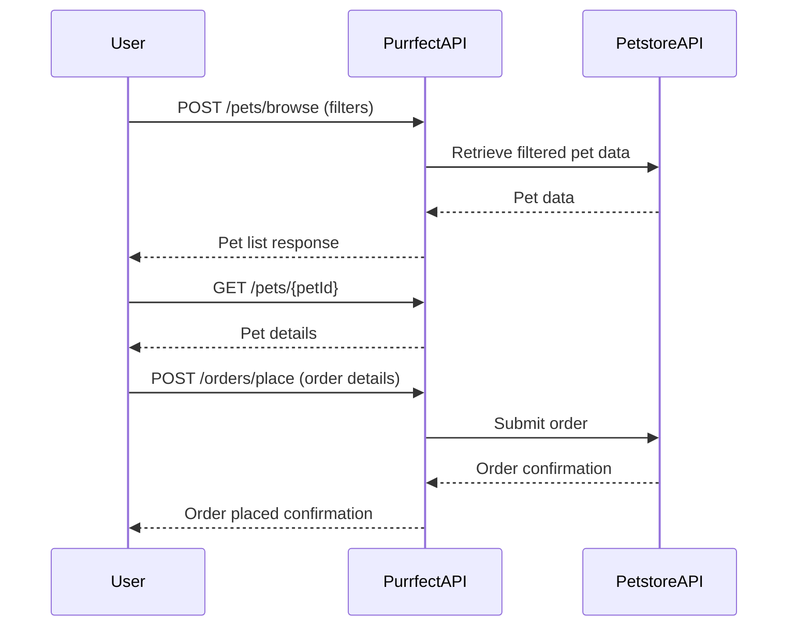
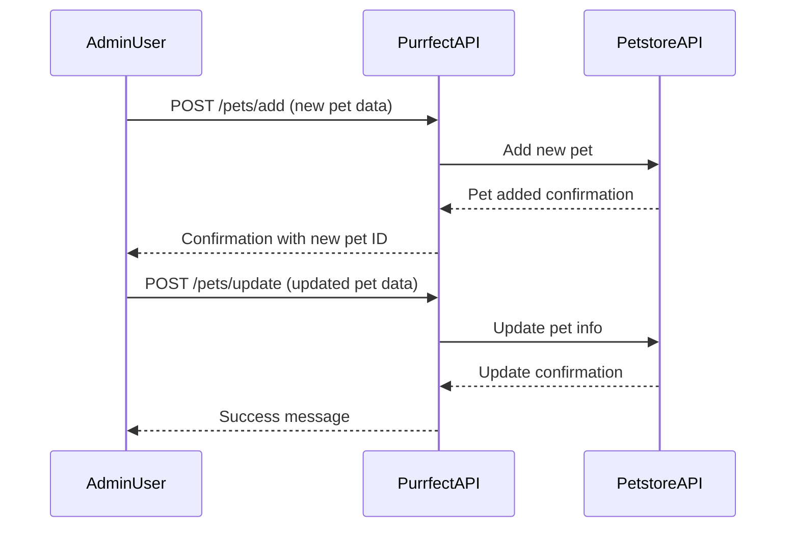

```markdown
# Purrfect Pets API - Functional Requirements

## API Endpoints

### 1. Browse Pets  
**POST** `/pets/browse`  
- **Description:** Retrieve a filtered and paginated list of pets from the Petstore API data.  
- **Request Body:**  
```json
{
  "type": "string (optional, e.g. cat, dog)",
  "status": "string (optional, e.g. available, sold)",
  "search": "string (optional, keyword search)",
  "page": "integer (optional, default 1)",
  "pageSize": "integer (optional, default 20)"
}
```  
- **Response:**  
```json
{
  "pets": [
    {
      "id": "integer",
      "name": "string",
      "type": "string",
      "status": "string",
      "photoUrls": ["string"]
    }
  ],
  "page": "integer",
  "pageSize": "integer",
  "total": "integer"
}
```

### 2. View Pet Details  
**GET** `/pets/{petId}`  
- **Description:** Retrieve detailed information about a specific pet by ID.  
- **Response:**  
```json
{
  "id": "integer",
  "name": "string",
  "type": "string",
  "status": "string",
  "photoUrls": ["string"],
  "tags": ["string"],
  "description": "string"
}
```

### 3. Add New Pet  
**POST** `/pets/add`  
- **Description:** Add a new pet to the system (mirrors Petstore API).  
- **Request Body:**  
```json
{
  "name": "string",
  "type": "string",
  "status": "string",
  "photoUrls": ["string"],
  "tags": ["string"],
  "description": "string (optional)"
}
```  
- **Response:**  
```json
{
  "id": "integer",
  "message": "Pet added successfully"
}
```

### 4. Update Pet  
**POST** `/pets/update`  
- **Description:** Update an existing pet's information.  
- **Request Body:**  
```json
{
  "id": "integer",
  "name": "string (optional)",
  "type": "string (optional)",
  "status": "string (optional)",
  "photoUrls": ["string"] (optional),
  "tags": ["string"] (optional),
  "description": "string (optional)"
}
```  
- **Response:**  
```json
{
  "message": "Pet updated successfully"
}
```

### 5. Delete Pet  
**POST** `/pets/delete`  
- **Description:** Remove a pet by ID.  
- **Request Body:**  
```json
{
  "id": "integer"
}
```  
- **Response:**  
```json
{
  "message": "Pet deleted successfully"
}
```

### 6. Place Order  
**POST** `/orders/place`  
- **Description:** Place an order for a pet.  
- **Request Body:**  
```json
{
  "petId": "integer",
  "quantity": "integer",
  "shipDate": "string (ISO 8601 date-time)",
  "status": "string (e.g. placed, approved, delivered)",
  "complete": "boolean"
}
```  
- **Response:**  
```json
{
  "orderId": "integer",
  "message": "Order placed successfully"
}
```

### 7. View Order Details  
**GET** `/orders/{orderId}`  
- **Description:** Retrieve order details by order ID.  
- **Response:**  
```json
{
  "orderId": "integer",
  "petId": "integer",
  "quantity": "integer",
  "shipDate": "string (ISO 8601 date-time)",
  "status": "string",
  "complete": "boolean"
}
```

---

## Error Handling  
- Errors should return meaningful messages with appropriate HTTP status codes (400, 404, 500 etc.).

---

## Mermaid Sequence Diagram: User Browses and Orders a Pet



---

## Mermaid Sequence Diagram: Adding and Updating a Pet


```