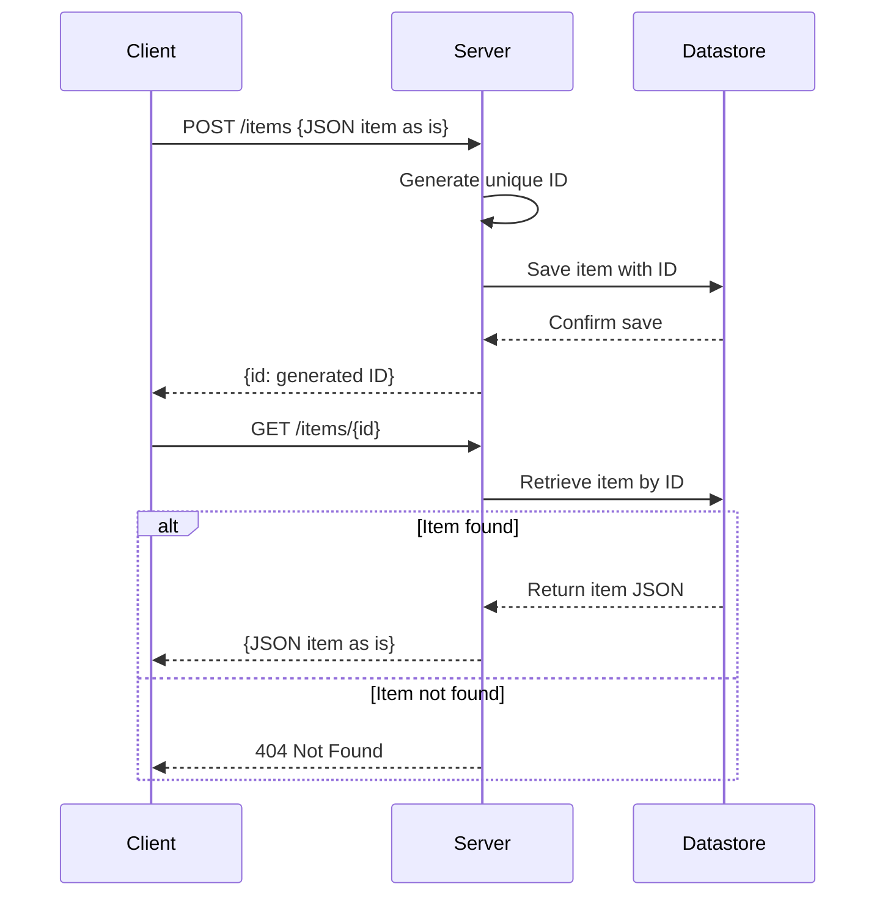

# Functional Requirements for Hacker News Item Service

## API Endpoints

### 1. POST /items  
- **Purpose:** Store a Hacker News item JSON, generate a unique ID, and persist it.  
- **Request Body:**  
  - Accept the JSON item **as is** without wrapping it in any additional object.  
  - Example:  
    ```json
    {
      <arbitrary JSON representing the Hacker News item>
    }
    ```  
- **Response:**  
  ```json
  {
    "id": "<generated-unique-id>"
  }
  ```  
- **Business Logic:**  
  - Generate a unique ID on the server side.  
  - Persist the entire provided JSON item as-is in the datastore.  
  - Return the generated ID to the client.

---

### 2. GET /items/{id}  
- **Purpose:** Retrieve a previously stored Hacker News item by its ID.  
- **Response:**  
  - Return the stored JSON item **as is**.  
  - Example:  
    ```json
    {
      <stored JSON item>
    }
    ```  
- **Error Response:**  
  - Return HTTP 404 if the item with the given ID is not found.  
- **Business Logic:**  
  - Fetch the stored item by ID from the datastore.  
  - Return the item JSON as-is if found.

---

## User-App Interaction Sequence Diagram



---

If you have no further questions or changes, I will now finish the discussion.