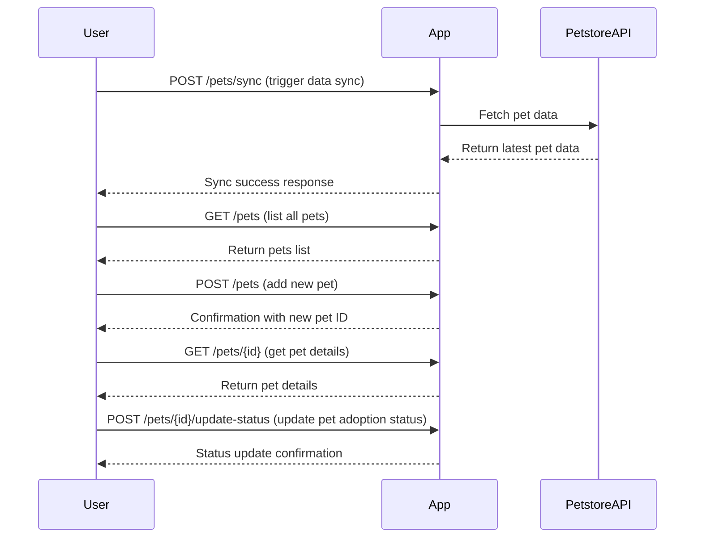

# Purrfect Pets API - Functional Requirements

## API Endpoints

### 1. POST /pets/sync  
**Description:** Synchronize or update the local pet data by fetching from the external Petstore API.  
**Request:**  
```json
{
  "action": "sync"
}
```  
**Response:**  
```json
{
  "status": "success",
  "syncedCount": 50
}
```

### 2. GET /pets  
**Description:** Retrieve a list of all pets stored in the application.  
**Response:**  
```json
[
  {
    "id": 1,
    "name": "Fluffy",
    "type": "Cat",
    "status": "Available"
  },
  {
    "id": 2,
    "name": "Buddy",
    "type": "Dog",
    "status": "Adopted"
  }
]
```

### 3. POST /pets  
**Description:** Add a new pet to the local store. This endpoint can also be used to calculate or process additional pet-related info if needed.  
**Request:**  
```json
{
  "name": "Whiskers",
  "type": "Cat",
  "status": "Available"
}
```  
**Response:**  
```json
{
  "id": 101,
  "message": "Pet added successfully"
}
```

### 4. GET /pets/{id}  
**Description:** Retrieve details of a specific pet by ID.  
**Response:**  
```json
{
  "id": 1,
  "name": "Fluffy",
  "type": "Cat",
  "status": "Available",
  "details": "Loves to nap in the sun"
}
```

### 5. POST /pets/{id}/update-status  
**Description:** Update the adoption status or any other status-related info for a pet by ID.  
**Request:**  
```json
{
  "status": "Adopted"
}
```  
**Response:**  
```json
{
  "id": 1,
  "message": "Status updated successfully"
}
```

---

## User-App Interaction Sequence Diagram



---

## Notes  
- All POST endpoints perform business logic including calls to external APIs, data processing, or updates.  
- All GET endpoints return locally stored data only, with no direct external API calls.