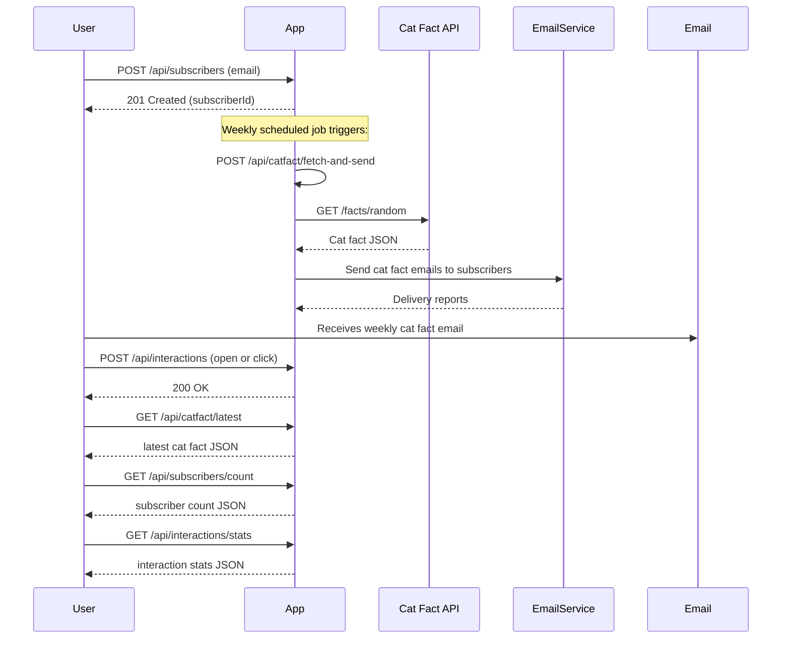

```markdown
# Weekly Cat Fact Subscription - Functional Requirements & API Design

## API Endpoints

### 1. Subscriber Management

- **POST /api/subscribers**
  - Register a new subscriber by email.
  - **Request:**
    ```json
    {
      "email": "user@example.com"
    }
    ```
  - **Response:**
    ```json
    {
      "subscriberId": "uuid",
      "email": "user@example.com",
      "status": "subscribed"
    }
    ```

- **GET /api/subscribers/count**
  - Get total number of subscribers.
  - **Response:**
    ```json
    {
      "count": 1234
    }
    ```

---

### 2. Cat Fact Ingestion & Publishing

- **POST /api/catfact/fetch-and-send**
  - Trigger ingestion of a new cat fact from external API and send emails to all subscribers.
  - **Request:**
    ```json
    {}
    ```
  - **Response:**
    ```json
    {
      "factId": "uuid",
      "catFact": "Cats can make over 100 vocal sounds.",
      "emailsSent": 1234
    }
    ```

- **GET /api/catfact/latest**
  - Retrieve the latest cat fact sent to subscribers.
  - **Response:**
    ```json
    {
      "factId": "uuid",
      "catFact": "Cats can make over 100 vocal sounds.",
      "sentDate": "2024-04-20T10:00:00Z"
    }
    ```

---

### 3. Interaction Reporting

- **POST /api/interactions**
  - Record subscriber interactions (open or click) with cat fact emails.
  - **Request:**
    ```json
    {
      "subscriberId": "uuid",
      "factId": "uuid",
      "interactionType": "open"  // or "click"
    }
    ```
  - **Response:**
    ```json
    {
      "status": "recorded"
    }
    ```

- **GET /api/interactions/stats**
  - Retrieve aggregated interaction statistics.
  - **Response:**
    ```json
    {
      "totalOpens": 500,
      "totalClicks": 150
    }
    ```

---

## User-App Interaction Sequence


```