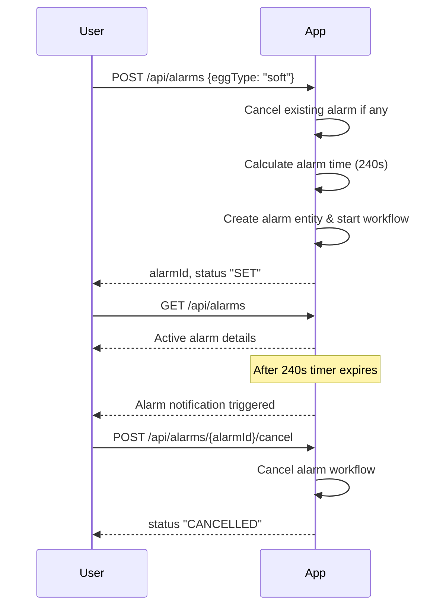

```markdown
# Egg Alarm App - Functional Requirements and API Design

## Functional Requirements

1. User selects egg type: soft-boiled, medium-boiled, or hard-boiled.
2. User sets the alarm, which is automatically timed based on the egg type:
   - Soft-boiled: 4 minutes (240 seconds)
   - Medium-boiled: 7 minutes (420 seconds)
   - Hard-boiled: 10 minutes (600 seconds)
3. Only one alarm can be active at a time.
4. User retrieves the current active alarm and its status.
5. User can cancel the active alarm.
6. Alarm triggers a notification when time is up (simple alert).

---

## API Endpoints

### 1. Set Alarm  
**POST** `/api/alarms`  
- Sets an alarm based on the selected egg type.  
- Automatically calculates alarm time from egg type.  
- Creates an alarm entity and starts its workflow.  
- Only one alarm can be active; setting a new alarm cancels any existing one.

**Request Body** (application/json):
```json
{
  "eggType": "soft" | "medium" | "hard"
}
```

**Response** (application/json):
```json
{
  "alarmId": "string",
  "eggType": "soft" | "medium" | "hard",
  "setTimeSeconds": 240,
  "status": "SET"
}
```

---

### 2. Get Active Alarm  
**GET** `/api/alarms`  
- Retrieves the current active alarm and its status.  
- Returns empty if no active alarm.

**Response** (application/json):
```json
{
  "alarmId": "string",
  "eggType": "soft" | "medium" | "hard",
  "setTimeSeconds": 240,
  "status": "SET" | "TRIGGERED"
}
```

---

### 3. Cancel Alarm  
**POST** `/api/alarms/{alarmId}/cancel`  
- Cancels the specified active alarm and stops its workflow.

**Response** (application/json):
```json
{
  "alarmId": "string",
  "status": "CANCELLED"
}
```

---

## User-App Interaction Sequence


```