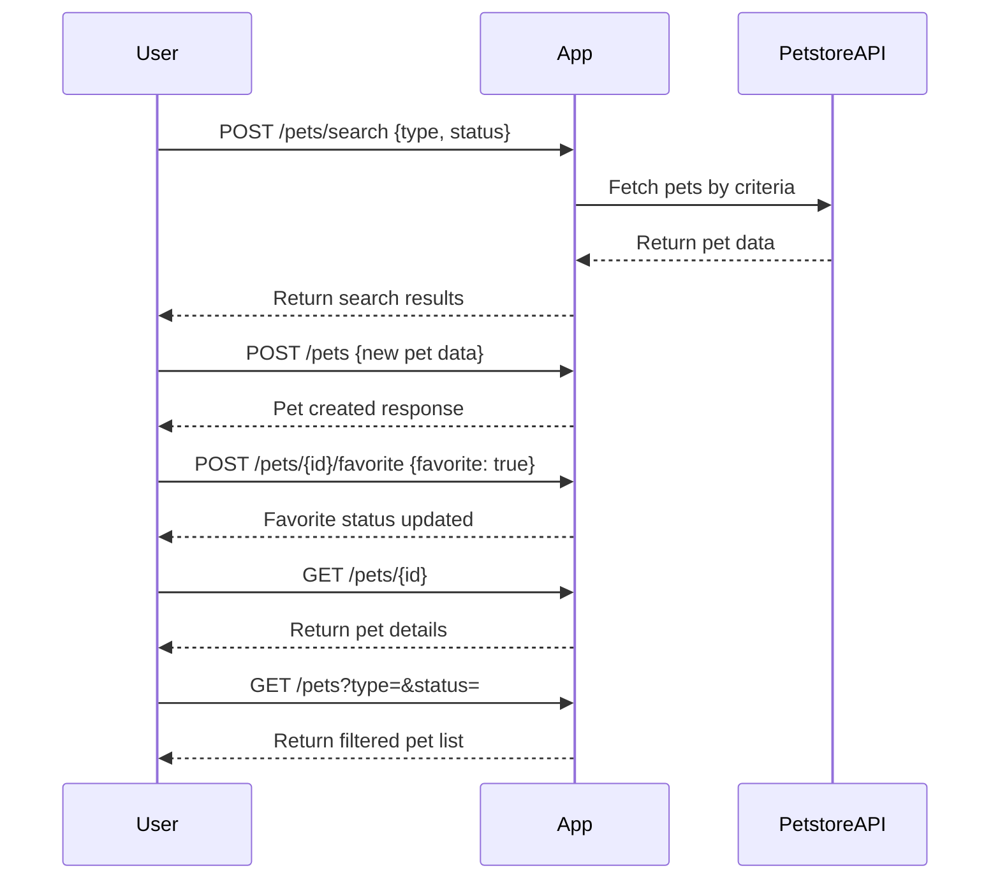

# Purrfect Pets API - Functional Requirements and API Endpoints

## Functional Requirements

- Manage pets data leveraging external Petstore API.
- Support full CRUD operations on pets.
- Business logic involving external Petstore API data retrieval or updates must be done through POST endpoints.
- GET endpoints are used only to retrieve results processed or stored by the application.
- Support filtering/searching pets by attributes such as type and status.
- Allow marking/unmarking pets as favorites.
- Use JSON format for all request and response bodies.

---

## API Endpoints

### 1. POST /pets/search  
**Description:** Search pets using criteria by querying external Petstore API.  
**Request Body:**  
```json
{
  "type": "string (optional)",
  "status": "string (optional)"
}
```

**Response:**  
```json
{
  "pets": [
    {
      "id": 123,
      "name": "Whiskers",
      "type": "Cat",
      "status": "available",
      "photoUrls": ["http://example.com/photo1.jpg"],
      "favorite": false
    }
  ]
}
```

---

### 2. GET /pets  
**Description:** Retrieve stored or cached pets in the application (optionally filtered).  
**Query Parameters:**  
- `type` (optional)  
- `status` (optional)  

**Response:**  
```json
{
  "pets": [
    {
      "id": 123,
      "name": "Whiskers",
      "type": "Cat",
      "status": "available",
      "photoUrls": ["http://example.com/photo1.jpg"],
      "favorite": true
    }
  ]
}
```

---

### 3. POST /pets  
**Description:** Add a new pet to the application data store.  
**Request Body:**  
```json
{
  "name": "string",
  "type": "string",
  "status": "string",
  "photoUrls": ["string"]
}
```

**Response:**  
```json
{
  "id": 124,
  "message": "Pet created successfully"
}
```

---

### 4. POST /pets/{id}/favorite  
**Description:** Mark or unmark a pet as favorite.  
**Request Body:**  
```json
{
  "favorite": true
}
```

**Response:**  
```json
{
  "id": 123,
  "favorite": true,
  "message": "Favorite status updated"
}
```

---

### 5. GET /pets/{id}  
**Description:** Retrieve pet details by ID from application data.  
**Response:**  
```json
{
  "id": 123,
  "name": "Whiskers",
  "type": "Cat",
  "status": "available",
  "photoUrls": ["http://example.com/photo1.jpg"],
  "favorite": true
}
```

---

## User-App Interaction Sequence Diagram

