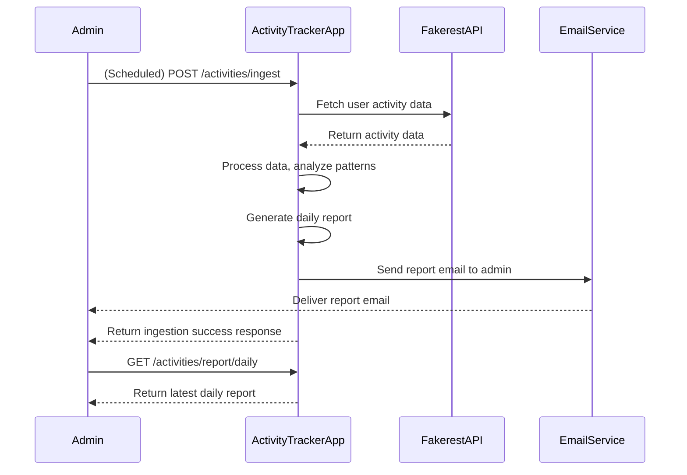
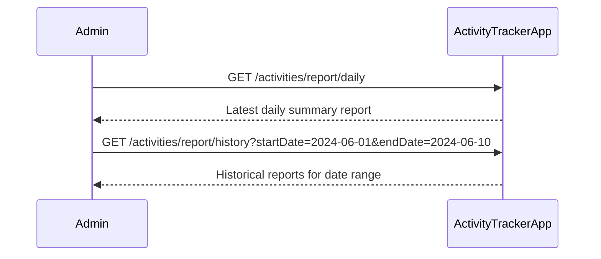

# Functional Requirements and API Design for Activity Tracker Application

## API Endpoints

### 1. POST /activities/ingest  
**Description:** Trigger data ingestion from the Fakerest API, process the data to identify patterns, and generate the daily report.  
**Request Body:**  
```json
{}
```  
(No parameters needed, this endpoint triggers the scheduled ingestion and processing)  

**Response:**  
```json
{
  "status": "success",
  "message": "Data ingested, processed, and report generated."
}
```

---

### 2. GET /activities/report/daily  
**Description:** Retrieve the latest daily summary report of user activities.  
**Response:**  
```json
{
  "date": "2024-06-15",
  "summary": {
    "totalUsers": 120,
    "totalActivities": 450,
    "patterns": {
      "mostFrequentActivity": "Running",
      "averageActivitiesPerUser": 3.75,
      "anomaliesDetected": [
        {
          "userId": 45,
          "activity": "Cycling",
          "note": "Unusually high frequency"
        }
      ]
    }
  }
}
```

---

### 3. GET /activities/report/history  
**Description:** Retrieve historical daily reports for a given date range.  
**Query Parameters:**  
- `startDate` (required, ISO date string)  
- `endDate` (required, ISO date string)  

**Response:**  
```json
[
  {
    "date": "2024-06-14",
    "summary": { ... }
  },
  {
    "date": "2024-06-15",
    "summary": { ... }
  }
]
```

---

## Business Logic Notes

- The `POST /activities/ingest` endpoint handles:
  - Fetching activity data from the Fakerest API.
  - Processing the data to find patterns (frequency, activity types, anomalies).
  - Generating and storing the daily report.
  - Sending the report to the admin email.
- The `GET` endpoints are readonly and provide access to stored reports only.

---

## User-App Interaction Sequence Diagram



---

## User Report Retrieval Journey

