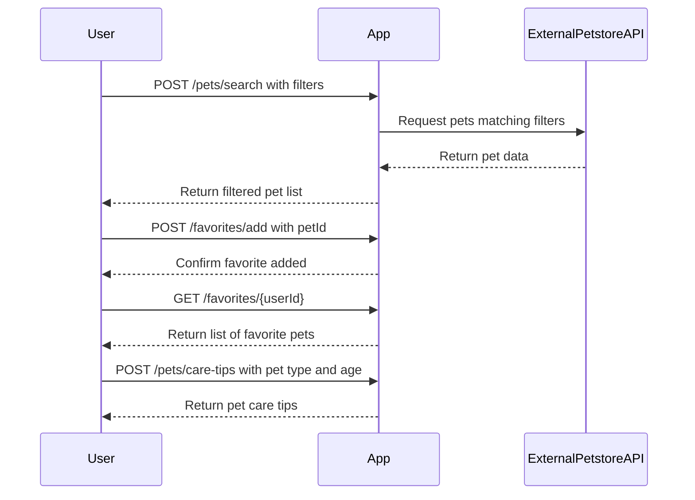

# Purrfect Pets API - Functional Requirements

## API Endpoints

### 1. POST /pets/search  
**Description:** Retrieve pet data from the external Petstore API based on search criteria.  
**Request:**  
```json
{
  "type": "cat" | "dog" | "all",
  "status": "available" | "pending" | "sold",
  "name": "optional string"
}
```  
**Response:**  
```json
{
  "pets": [
    {
      "id": 123,
      "name": "Fluffy",
      "type": "cat",
      "status": "available",
      "description": "Playful kitten",
      "age": 2
    }
  ]
}
```

---

### 2. POST /favorites/add  
**Description:** Add a pet to the user's favorites.  
**Request:**  
```json
{
  "userId": "string",
  "petId": 123
}
```  
**Response:**  
```json
{
  "success": true,
  "message": "Pet added to favorites"
}
```

---

### 3. GET /favorites/{userId}  
**Description:** Retrieve the list of favorite pets for a user.  
**Response:**  
```json
{
  "userId": "string",
  "favorites": [
    {
      "petId": 123,
      "name": "Fluffy",
      "type": "cat",
      "status": "available"
    }
  ]
}
```

---

### 4. POST /pets/care-tips  
**Description:** Provide pet care tips based on pet type and age.  
**Request:**  
```json
{
  "type": "cat" | "dog" | "all",
  "age": 0-20
}
```  
**Response:**  
```json
{
  "tips": [
    "Ensure your cat has fresh water at all times.",
    "Regular vet checkups are important."
  ]
}
```

---

## User-App Interaction Sequence Diagram

