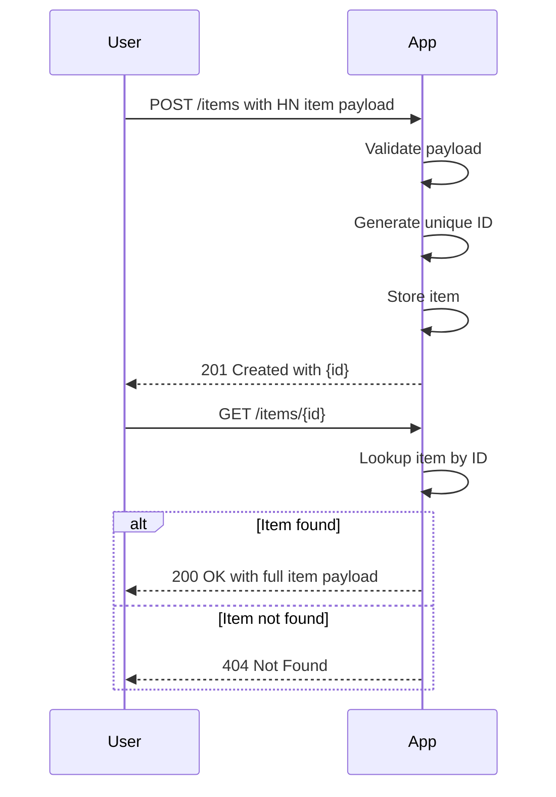

# Functional Requirements for Hacker News Items Storage App

## API Endpoints

### 1. POST /items  
- **Purpose:** Store a Hacker News item (payload matches HN Firebase response shape).  
- **Request:**  
  - Content-Type: application/json  
  - Body: Full Hacker News item JSON payload  
- **Response:**  
  - Status: 201 Created  
  - Body: `{ "id": "<generated-item-id>" }`  
- **Business Logic:**  
  - Validate payload structure.  
  - Generate unique ID for the item.  
  - Store item in the system.  
  - Return the generated ID.  

### 2. GET /items/{id}  
- **Purpose:** Retrieve stored Hacker News item by its ID.  
- **Request:**  
  - Path parameter: `id` (string)  
- **Response:**  
  - Status: 200 OK (if found)  
  - Body: Full stored Hacker News item JSON payload  
  - Status: 404 Not Found (if no item with the given ID)  

---

# User-App Interaction Sequence Diagram

---

# Summary of request/response formats

| Endpoint      | Request Body                     | Response Body                   | Status Codes         |
|---------------|---------------------------------|--------------------------------|----------------------|
| POST /items   | Full HN Firebase item JSON       | `{ "id": "<generated-id>" }`   | 201 Created          |
| GET /items/{id} | None (id in path)               | Full HN Firebase item JSON      | 200 OK, 404 Not Found |