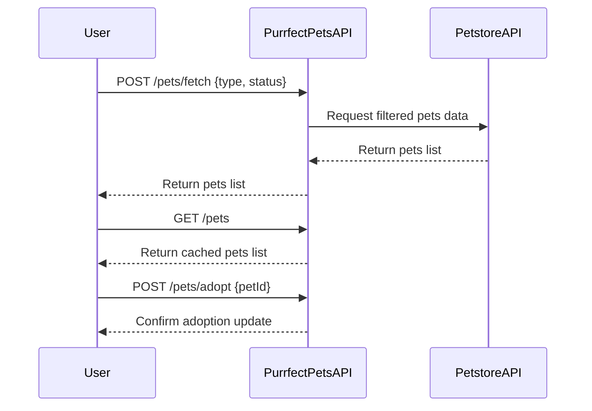

# Purrfect Pets API Functional Requirements

## API Endpoints

### 1. POST /pets/fetch  
**Description:** Retrieve pets data from the external Petstore API based on filters or criteria. Performs all external data fetching and business logic.  
**Request:**  
```json
{
  "type": "string",        // optional, e.g., "cat", "dog"
  "status": "string"       // optional, e.g., "available", "sold", "pending"
}
```  
**Response:**  
```json
{
  "pets": [
    {
      "id": "integer",
      "name": "string",
      "type": "string",
      "status": "string",
      "photoUrls": ["string"]
    },
    ...
  ]
}
```

---

### 2. GET /pets  
**Description:** Retrieve the last fetched list of pets stored or cached in the application (no external calls).  
**Request:** None  
**Response:**  
```json
{
  "pets": [
    {
      "id": "integer",
      "name": "string",
      "type": "string",
      "status": "string",
      "photoUrls": ["string"]
    },
    ...
  ]
}
```

---

### 3. POST /pets/adopt  
**Description:** Mark a pet as adopted; updates internal state or workflow.  
**Request:**  
```json
{
  "petId": "integer"
}
```  
**Response:**  
```json
{
  "success": true,
  "message": "Pet adoption status updated."
}
```

---

## Business Logic Notes
- All external API calls to Petstore API are done only inside POST `/pets/fetch`.
- GET `/pets` returns cached or stored data fetched previously by `/pets/fetch`.
- POST `/pets/adopt` triggers workflow to update pet adoption status internally.

---

## User-App Interaction Sequence Diagram

