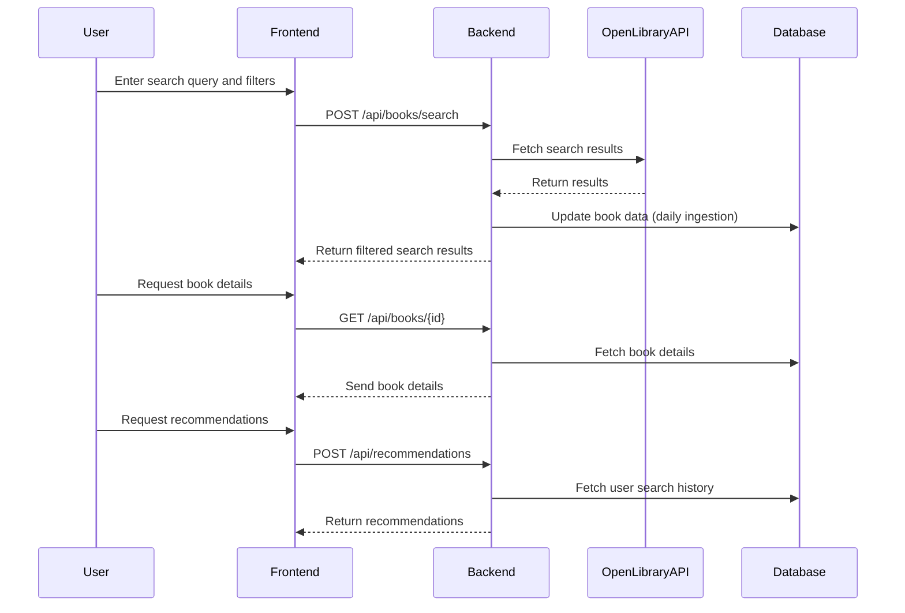
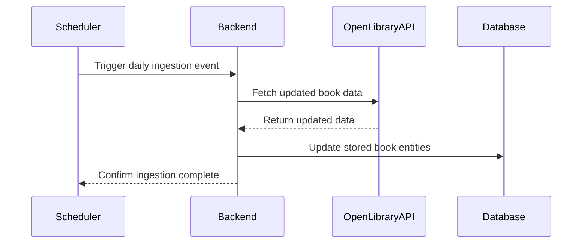

```markdown
# Functional Requirements and API Design for Book Search and Recommendation Application

## API Endpoints

### 1. Search Books  
**POST /api/books/search**  
- Description: Search books using Open Library API, apply filters (genre, publication year, author).  
- Request Body:
```json
{
  "query": "string",
  "filters": {
    "genre": ["string"],
    "publicationYear": {"from": 2000, "to": 2024},
    "author": ["string"]
  },
  "page": 1,
  "pageSize": 20
}
```  
- Response:
```json
{
  "totalResults": 100,
  "results": [
    {
      "title": "string",
      "authors": ["string"],
      "coverImageUrl": "string",
      "genres": ["string"],
      "publicationYear": 2020,
      "openLibraryId": "string"
    }
  ]
}
```

### 2. Get Book Details  
**GET /api/books/{openLibraryId}**  
- Description: Retrieve detailed info of a stored book.  
- Response:
```json
{
  "title": "string",
  "authors": ["string"],
  "coverImageUrl": "string",
  "genres": ["string"],
  "publicationYear": 2020,
  "description": "string",
  "openLibraryId": "string"
}
```

### 3. Get Available Filters  
**GET /api/filters**  
- Description: Retrieve available genres, authors, and publication years for filtering UI.  
- Response:
```json
{
  "genres": ["string"],
  "authors": ["string"],
  "publicationYears": [1990, 1991, ..., 2024]
}
```

### 4. Generate Weekly Report  
**POST /api/reports/weekly**  
- Description: Trigger weekly report generation on most searched books and user preferences.  
- Request Body:
```json
{
  "weekStartDate": "YYYY-MM-DD"
}
```
- Response:
```json
{
  "reportId": "string",
  "status": "processing|completed",
  "generatedAt": "ISO8601-timestamp"
}
```

### 5. Get Weekly Report  
**GET /api/reports/weekly/{reportId}**  
- Description: Retrieve generated weekly report.  
- Response:
```json
{
  "mostSearchedBooks": [
    {"title": "string", "searchCount": 123}
  ],
  "userPreferences": {
    "topGenres": ["string"],
    "topAuthors": ["string"]
  }
}
```

### 6. Get Recommendations  
**POST /api/recommendations**  
- Description: Provide personalized book recommendations based on user search history.  
- Request Body:
```json
{
  "userId": "string",
  "limit": 10
}
```
- Response:
```json
{
  "recommendations": [
    {
      "title": "string",
      "authors": ["string"],
      "coverImageUrl": "string",
      "openLibraryId": "string"
    }
  ]
}
```

---

## User-App Interaction Sequence Diagram



---

## Daily Data Ingestion Workflow


```