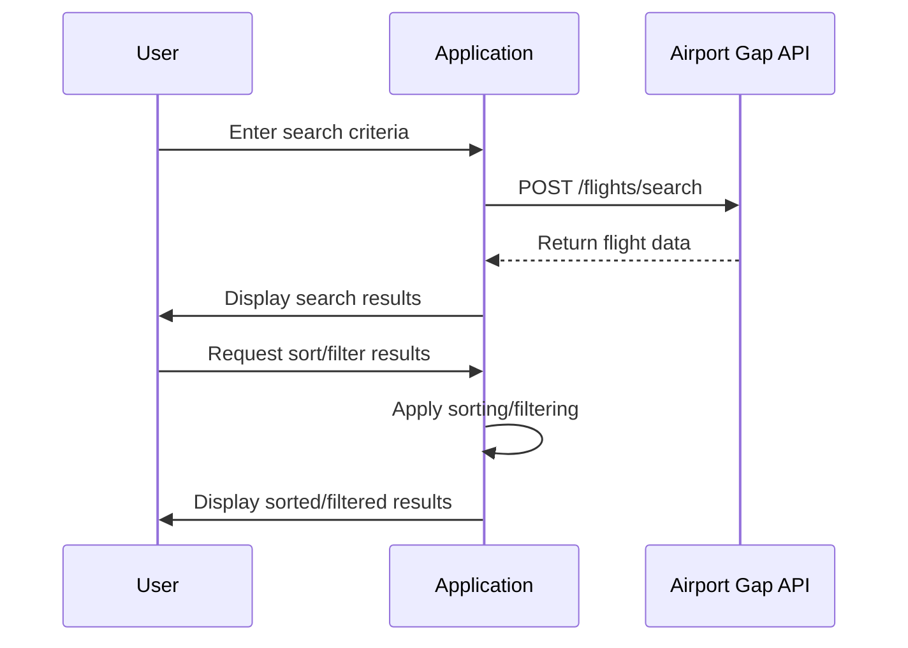

# Final Functional Requirements for Flight Search Application

## API Endpoints

### 1. Search Flights
- **Endpoint**: `/api/flights/search`
- **Method**: `POST`
- **Description**: Searches for flights using the Airport Gap API based on user input.
- **Request Format**:
  ```json
  {
    "departureAirport": "JFK",
    "arrivalAirport": "LAX",
    "departureDate": "2023-12-01",
    "returnDate": "2023-12-15",
    "passengers": 2
  }
  ```
- **Response Format**:
  ```json
  {
    "flights": [
      {
        "airline": "Airline Name",
        "flightNumber": "1234",
        "departureTime": "2023-12-01T08:00:00",
        "arrivalTime": "2023-12-01T11:00:00",
        "price": 350.00
      }
    ]
  }
  ```

### 2. Retrieve Search Results
- **Endpoint**: `/api/flights/results`
- **Method**: `GET`
- **Description**: Retrieves the results of the most recent flight search.
- **Response Format**:
  ```json
  {
    "flights": [
      {
        "airline": "Airline Name",
        "flightNumber": "1234",
        "departureTime": "2023-12-01T08:00:00",
        "arrivalTime": "2023-12-01T11:00:00",
        "price": 350.00
      }
    ]
  }
  ```

### 3. Sort and Filter Results
- **Endpoint**: `/api/flights/sort-filter`
- **Method**: `POST`
- **Description**: Applies sorting and filtering to the flight search results.
- **Request Format**:
  ```json
  {
    "sortBy": "price",
    "filter": {
      "maxPrice": 400,
      "timeRange": {
        "earliestDeparture": "06:00",
        "latestArrival": "23:00"
      }
    }
  }
  ```
- **Response Format**:
  ```json
  {
    "flights": [
      {
        "airline": "Airline Name",
        "flightNumber": "1234",
        "departureTime": "2023-12-01T08:00:00",
        "arrivalTime": "2023-12-01T11:00:00",
        "price": 350.00
      }
    ]
  }
  ```

## User-App Interaction Diagram



These requirements ensure that the application provides a comprehensive and user-friendly flight search experience while adhering to RESTful API design principles.