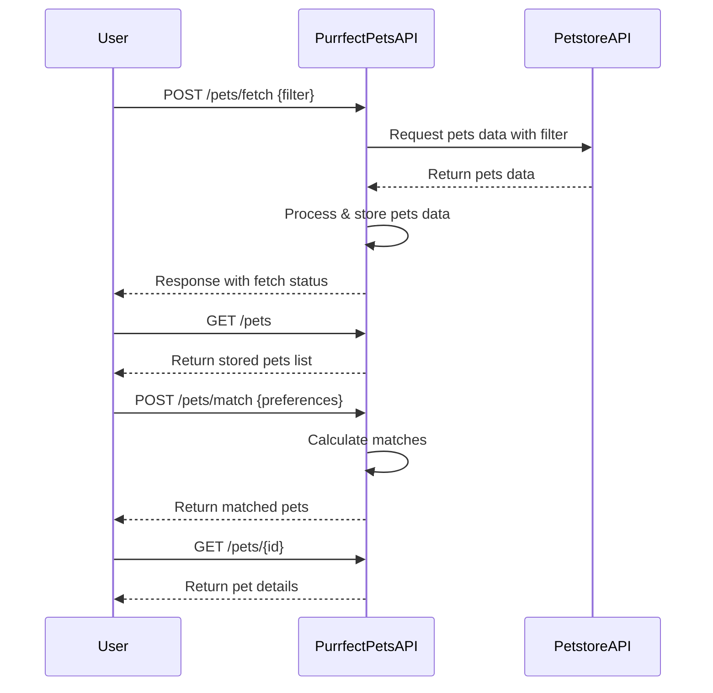

# Purrfect Pets API - Functional Requirements and API Endpoints

## 1. API Endpoints Overview

### 1.1 POST /pets/fetch  
- **Purpose:** Fetch and process pets data from the external Petstore API.  
- **Request:**  
```json
{
  "filter": {
    "status": "available"  // optional: e.g., available, pending, sold
  }
}
```  
- **Response:**  
```json
{
  "message": "Pets data fetched and processed successfully",
  "count": 25
}
```

### 1.2 GET /pets  
- **Purpose:** Retrieve the list of pets stored or processed by the app.  
- **Response:**  
```json
[
  {
    "id": 1,
    "name": "Whiskers",
    "category": "Cat",
    "status": "available"
  },
  ...
]
```

### 1.3 POST /pets/match  
- **Purpose:** Calculate and return pet matches based on user preferences.  
- **Request:**  
```json
{
  "preferredCategory": "Cat",
  "preferredStatus": "available"
}
```  
- **Response:**  
```json
{
  "matches": [
    {
      "id": 3,
      "name": "Mittens",
      "category": "Cat",
      "status": "available"
    },
    ...
  ]
}
```

### 1.4 GET /pets/{id}  
- **Purpose:** Retrieve detailed information about a single pet by ID.  
- **Response:**  
```json
{
  "id": 1,
  "name": "Whiskers",
  "category": "Cat",
  "status": "available",
  "description": "A friendly cat looking for a home."
}
```

---

## 2. Business Logic

- **POST /pets/fetch:** Invokes external Petstore API, applies optional filters, stores or updates local data.  
- **POST /pets/match:** Performs matching logic based on user input and local pet data.  
- **GET endpoints:** Return data from local storage only, no external calls.

---

## 3. User-App Interaction Sequence Diagram



---

This version follows RESTful rules:  
- POST endpoints handle business logic, external API calls, and calculations.  
- GET endpoints retrieve data stored locally.  

If you want to proceed with this design or add any details, just let me know!