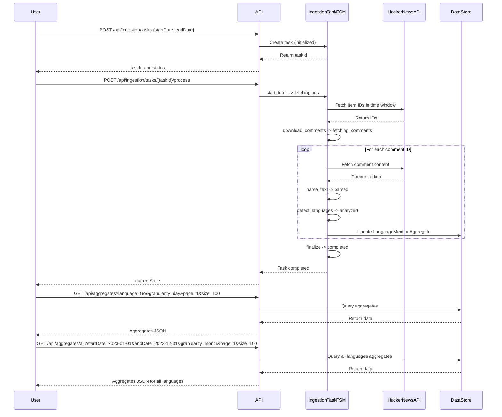

```markdown
# Final Functional Requirements and API Specification

## 1. Programming Languages Configuration
- Programming languages are loaded from `ConfigurationProperties` as a map:
  - Key: canonical language name (e.g., "Go")
  - Value: list of aliases (e.g., ["Golang"])
- Language mention matching is case-insensitive and matches exact words or any of the aliases.

## 2. Ingestion Task Management
- Each `CommentIngestionTask` is created with configurable ISO 8601 `startDate` and `endDate`.
- Tasks where `startDate` is equal to or after `endDate` are allowed and may result in zero records.
- Tasks transition through states: `initialized` → `fetching_ids` → `fetching_comments` → `completed` (or `aborted`/`failed`).
- External data fetching and processing is triggered by a POST endpoint.

## 3. Query API for Aggregates
- Supports querying mention frequencies filtered by:
  - Single language per query (canonical name)
  - Granularity selectable per request: `day`, `week`, or `month`
  - Pagination via `page` and `size` parameters
- Supports querying mention aggregates for **all** defined languages within a time window with pagination.

---

## API Endpoints

### 1. Create and Start Ingestion Task (POST)
- **URL:** `/api/ingestion/tasks`
- **Request Body:**
  ```json
  {
    "startDate": "2022-01-01T00:00:00Z",
    "endDate": "2024-01-01T00:00:00Z"
  }
  ```
- **Response:**
  ```json
  {
    "taskId": "string",
    "status": "initialized"
  }
  ```

### 2. Process Ingestion Task (POST)
- **URL:** `/api/ingestion/tasks/{taskId}/process`
- **Description:** Fetches IDs/comments, parses, analyzes, and updates aggregates.
- **Response:**
  ```json
  {
    "taskId": "string",
    "currentState": "fetching_comments"
  }
  ```

### 3. Query Aggregates by Language (GET)
- **URL:** `/api/aggregates`
- **Query Parameters:**
  - `language` (required)
  - `granularity` (`day`|`week`|`month`, default `day`)
  - `page` (default `1`)
  - `size` (default `100`)
- **Response:** Aggregate data with paging.

### 4. Query Aggregates for All Languages (GET)
- **URL:** `/api/aggregates/all`
- **Query Parameters:**
  - `startDate` (required)
  - `endDate` (required)
  - `granularity` (`day`|`week`|`month`, default `day`)
  - `page` (default `1`)
  - `size` (default `100`)
- **Response:** Aggregate data for all languages with paging.

### 5. List Ingestion Tasks (GET)
- **URL:** `/api/ingestion/tasks`
- **Response:** List of ingestion tasks with statuses.

---

## User-App Interaction (Sequence Diagram)



---

If this meets your expectations, I can proceed to finalize and close the discussion.  
Please let me know if you want any last changes or clarifications.
```