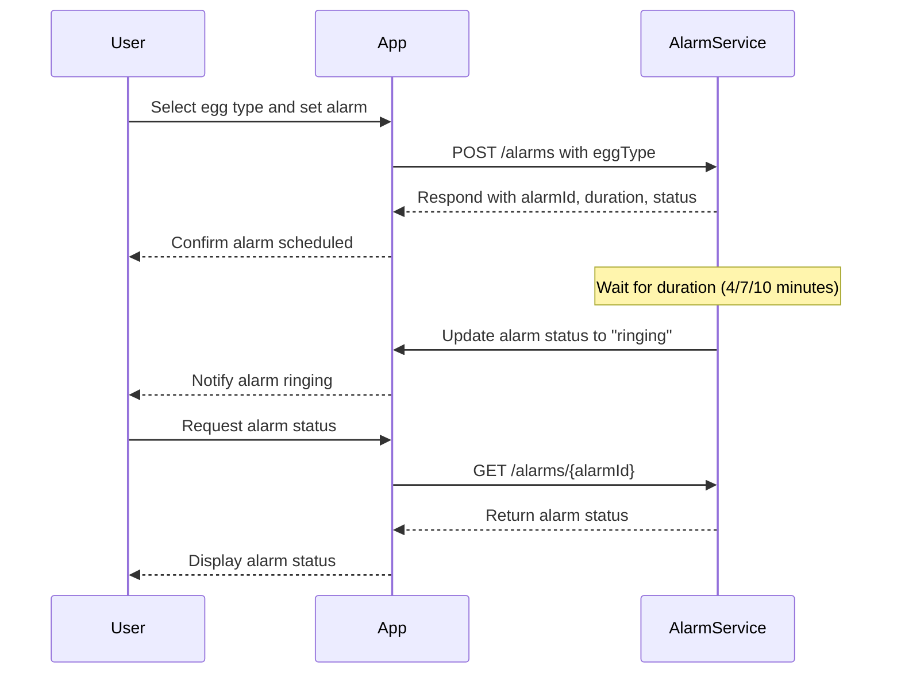

```markdown
# Egg Alarm App - Functional Requirements & API Specification

## Functional Requirements
- Users can choose egg type: **soft-boiled**, **medium-boiled**, or **hard-boiled**.
- Each egg type corresponds to a fixed alarm duration:
  - Soft-boiled: 4 minutes
  - Medium-boiled: 7 minutes
  - Hard-boiled: 10 minutes
- Users can set an alarm based on the selected egg type.
- Only one alarm can be active at a time per user.
- Users can retrieve the status of their alarm.
- When the alarm time elapses, the app triggers a notification event.

---

## API Endpoints

### 1. Create Alarm (POST `/alarms`)
Creates an alarm for the selected egg type.

- **Request Body**:
```json
{
  "eggType": "soft" | "medium" | "hard"
}
```

- **Response Body**:
```json
{
  "alarmId": "string",
  "eggType": "soft" | "medium" | "hard",
  "durationMinutes": 4 | 7 | 10,
  "status": "scheduled"
}
```

---

### 2. Get Alarm Status (GET `/alarms/{alarmId}`)
Retrieve the current status of a specific alarm.

- **Response Body**:
```json
{
  "alarmId": "string",
  "eggType": "soft" | "medium" | "hard",
  "durationMinutes": 4 | 7 | 10,
  "status": "scheduled" | "ringing" | "completed"
}
```

---

### 3. List All Alarms (GET `/alarms`)
Retrieve all alarms for the user.

- **Response Body**:
```json
[
  {
    "alarmId": "string",
    "eggType": "soft" | "medium" | "hard",
    "durationMinutes": 4 | 7 | 10,
    "status": "scheduled" | "ringing" | "completed"
  }
]
```

---

## User-App Interaction Sequence


```