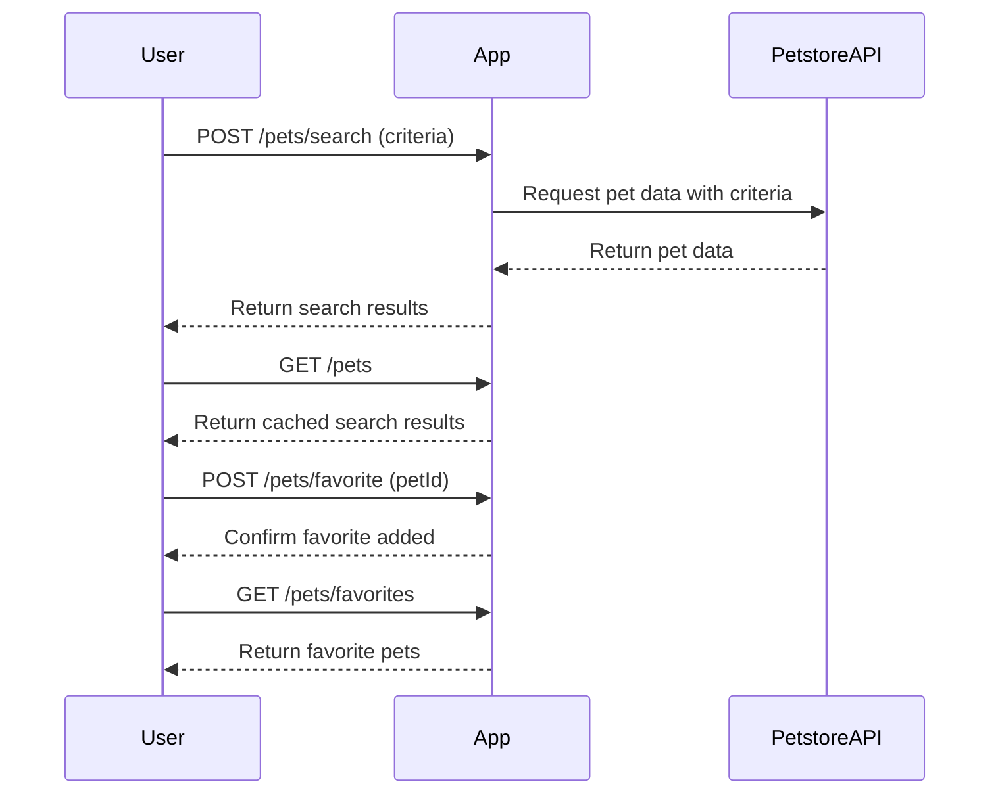

```markdown
# Purrfect Pets API - Functional Requirements

## Overview
The "Purrfect Pets" API app integrates with the external Petstore API to provide pet data. Following RESTful principles, all external data retrieval or business logic happens via POST endpoints, while GET endpoints serve cached or processed results stored within our app.

---

## API Endpoints

### 1. POST /pets/search  
**Description:** Search pets by criteria, fetching fresh data from Petstore API.  
**Request:**  
```json
{
  "type": "string",        // optional, e.g. "dog", "cat"
  "status": "string",      // optional, e.g. "available", "sold"
  "tags": ["string"]       // optional list of tags
}
```  
**Response:**  
```json
{
  "pets": [
    {
      "id": "number",
      "name": "string",
      "type": "string",
      "status": "string",
      "tags": ["string"]
    }
  ]
}
```

---

### 2. GET /pets  
**Description:** Retrieve the last searched pet results stored in the app.  
**Response:**  
```json
{
  "pets": [
    {
      "id": "number",
      "name": "string",
      "type": "string",
      "status": "string",
      "tags": ["string"]
    }
  ]
}
```

---

### 3. POST /pets/favorite  
**Description:** Add a pet to user’s favorites (stored internally).  
**Request:**  
```json
{
  "petId": "number"
}
```  
**Response:**  
```json
{
  "message": "Pet added to favorites"
}
```

---

### 4. GET /pets/favorites  
**Description:** Retrieve user’s favorite pets from internal storage.  
**Response:**  
```json
{
  "favorites": [
    {
      "id": "number",
      "name": "string",
      "type": "string",
      "status": "string",
      "tags": ["string"]
    }
  ]
}
```

---

## User-App Interaction Flow


```