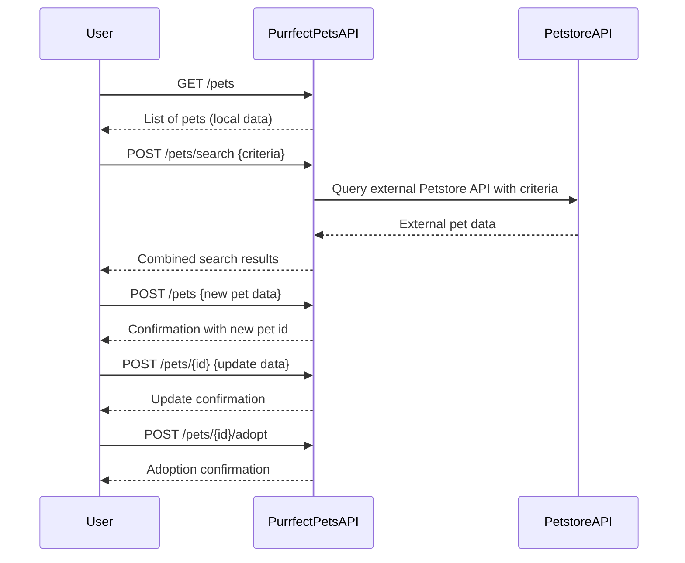
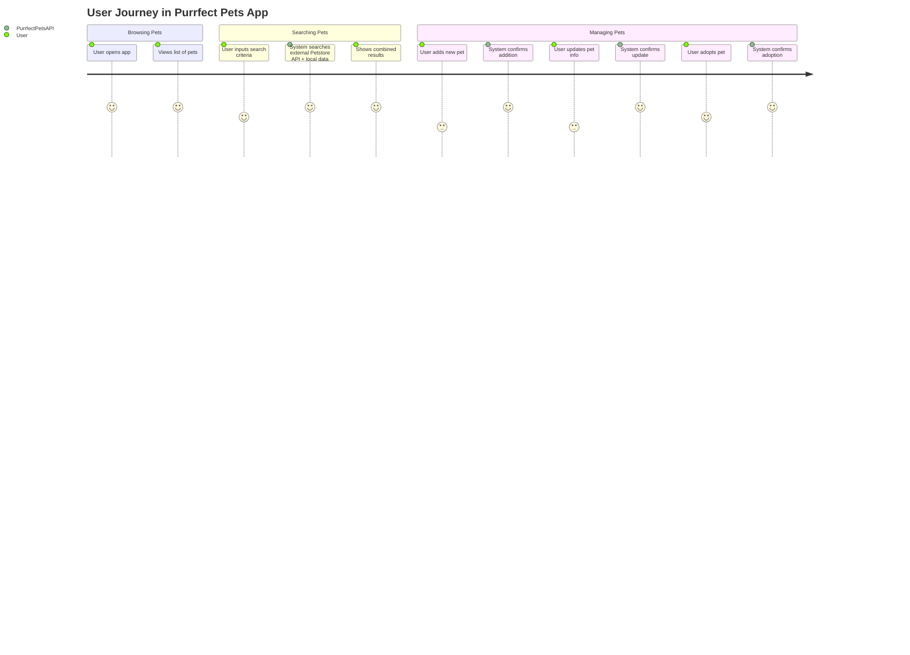

# Purrfect Pets API - Functional Requirements

## API Endpoints

### 1. List Pets  
- **Method:** GET  
- **Path:** `/pets`  
- **Description:** Retrieve the list of pets stored in the application (cached or user-added).  
- **Request:** No body  
- **Response:**  
```json
[
  {
    "id": "string",
    "name": "string",
    "type": "string",
    "age": "integer",
    "status": "available" | "adopted"
  },
  ...
]
```

---

### 2. Search Pets  
- **Method:** POST  
- **Path:** `/pets/search`  
- **Description:** Search and filter pets using criteria, invoking external Petstore API data and combining with local data if needed.  
- **Request:**  
```json
{
  "type": "string",         // optional
  "status": "string",       // optional
  "name": "string"          // optional, partial match
}
```  
- **Response:** Same as **List Pets** response format.

---

### 3. Add New Pet  
- **Method:** POST  
- **Path:** `/pets`  
- **Description:** Add a new pet to the local application data.  
- **Request:**  
```json
{
  "name": "string",
  "type": "string",
  "age": "integer",
  "status": "available"
}
```  
- **Response:**  
```json
{
  "id": "string",  // generated pet id
  "message": "Pet added successfully"
}
```

---

### 4. Update Pet Info  
- **Method:** POST  
- **Path:** `/pets/{id}`  
- **Description:** Update pet details such as name, type, age, or status.  
- **Request:**  
```json
{
  "name": "string",      // optional
  "type": "string",      // optional
  "age": "integer",      // optional
  "status": "string"     // optional
}
```  
- **Response:**  
```json
{
  "id": "string",
  "message": "Pet updated successfully"
}
```

---

### 5. Adopt Pet  
- **Method:** POST  
- **Path:** `/pets/{id}/adopt`  
- **Description:** Mark a pet as adopted, changing its status.  
- **Request:** No body  
- **Response:**  
```json
{
  "id": "string",
  "message": "Pet adopted successfully"
}
```

---

## Visual Representation: User-App Interaction



