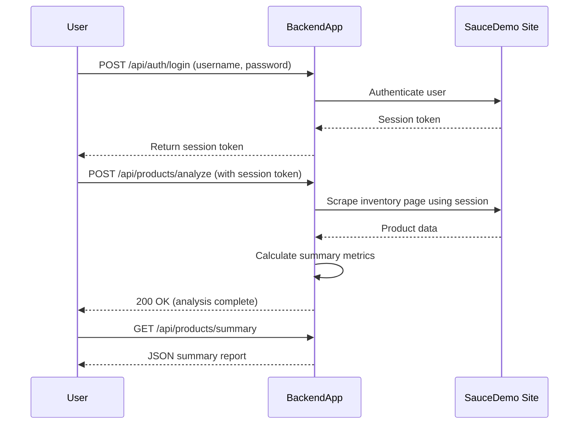

```markdown
# Final Functional Requirements for SauceDemo Product Analytics Application

## API Endpoints

### 1. Authenticate User and Retrieve Session  
**POST** `/api/auth/login`  
- **Description:** Authenticates user with SauceDemo credentials and returns a session token for authenticated scraping.  
- **Request Body:**  
```json
{
  "username": "standard_user",
  "password": "secret_sauce"
}
```  
- **Response:**  
```json
{
  "status": "success",
  "sessionToken": "abc123xyz",
  "message": "Login successful"
}
```

---

### 2. Trigger Data Scraping and Analysis  
**POST** `/api/products/analyze`  
- **Description:** Uses the authenticated session token to scrape the SauceDemo inventory page, analyze product data, and store summary metrics.  
- **Request Body:**  
```json
{
  "sessionToken": "abc123xyz"
}
```  
- **Response:**  
```json
{
  "status": "success",
  "message": "Data scraping and analysis completed",
  "timestamp": "2024-06-01T12:00:00Z"
}
```

---

### 3. Retrieve Summary Report  
**GET** `/api/products/summary`  
- **Description:** Returns the latest calculated summary report including total number of products, average price, highest/lowest priced items, and total inventory value.  
- **Response:**  
```json
{
  "totalProducts": 6,
  "averagePrice": 29.99,
  "highestPricedItem": {
    "itemName": "Test.allTheThings() T-Shirt (Red)",
    "price": 29.99
  },
  "lowestPricedItem": {
    "itemName": "Sauce Labs Bolt T-Shirt",
    "price": 15.99
  },
  "totalInventoryValue": 450.75
}
```

---

## Business Logic Notes  
- User authentication is mandatory to obtain a session token before scraping.  
- The POST `/api/products/analyze` endpoint performs authenticated scraping, data extraction, and summary calculation.  
- GET endpoints return stored results from the most recent analysis.  

---

## User-App Interaction Sequence Diagram


```

If you have no further questions or requests, I will mark this discussion as finished.