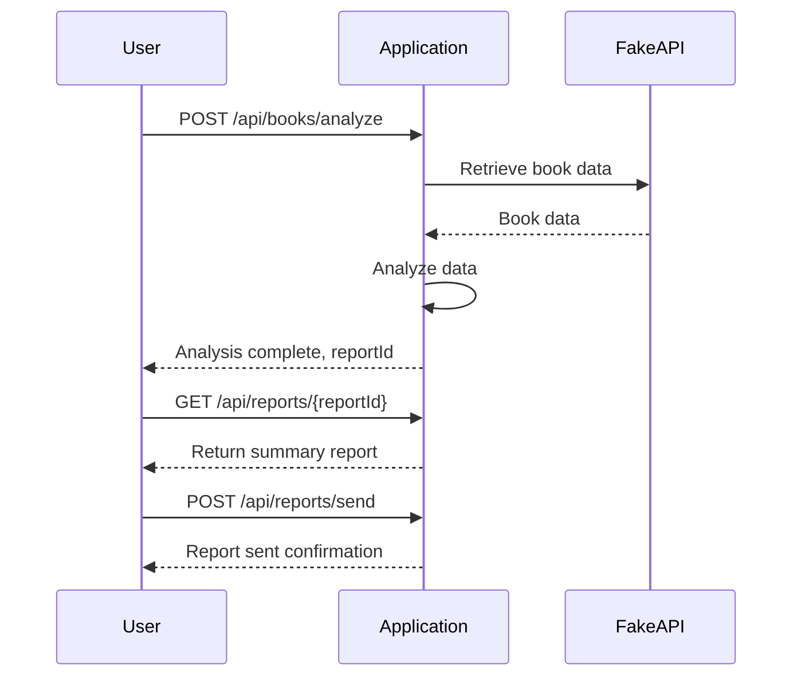

# Final Functional Requirements for Book Data Analysis Application

## API Endpoints

### 1. POST /api/books/analyze
- **Description**: Retrieves and analyzes book data from the Fake REST API based on specified criteria.
- **Request Body**: 
  ```json
  {
    "criteria": {
      "popularityThreshold": 300
    }
  }
  ```
- **Response**:
  ```json
  {
    "status": "success",
    "message": "Book data analyzed successfully",
    "reportId": "12345"
  }
  ```

### 2. GET /api/reports/{reportId}
- **Description**: Retrieves the generated summary report.
- **Response**:
  ```json
  {
    "reportId": "12345",
    "title": "Weekly Book Analysis",
    "content": "Summary of book titles, total page counts, and publication dates...",
    "format": "PDF"
  }
  ```

### 3. POST /api/reports/send
- **Description**: Sends the summary report via email to specified recipients.
- **Request Body**:
  ```json
  {
    "reportId": "12345",
    "recipients": ["analytics@company.com"]
  }
  ```
- **Response**:
  ```json
  {
    "status": "success",
    "message": "Report sent successfully"
  }
  ```

## User-App Interaction Diagram



This document provides a comprehensive overview of the application’s functional requirements, including API endpoints, request and response formats, and a visual representation of the user interaction with the application.