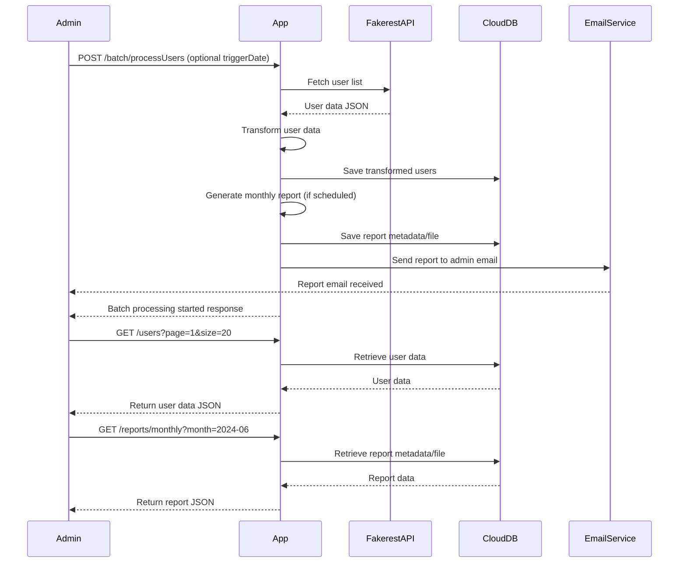

```markdown
# Functional Requirements and API Design

## API Endpoints

### 1. POST /batch/processUsers
- **Description:** Triggers the batch processing workflow:
  - Fetch users from Fakerest API
  - Transform and store user data
  - Generate monthly report if applicable
  - Send report email to admin
- **Request:**
  ```json
  {
    "triggerDate": "YYYY-MM-DD"  // Optional: date to trigger batch (defaults to current date)
  }
  ```
- **Response:**
  ```json
  {
    "status": "processing_started",
    "message": "Batch processing initiated",
    "batchId": "string"
  }
  ```

### 2. GET /users
- **Description:** Retrieve stored user data (optionally paginated/filterable)
- **Request Parameters:**
  - `page` (optional, integer)
  - `size` (optional, integer)
- **Response:**
  ```json
  {
    "users": [
      {
        "id": "int",
        "userName": "string",
        "email": "string",
        "...otherFields": "..."
      }
    ],
    "page": 1,
    "size": 20,
    "totalPages": 5
  }
  ```

### 3. GET /reports/monthly
- **Description:** Retrieve generated monthly reports metadata or content
- **Request Parameters:**
  - `month` (string, e.g., "2024-06")
- **Response:**
  ```json
  {
    "month": "2024-06",
    "reportUrl": "string",  // Link to stored report file (PDF or similar)
    "summary": {
      "totalUsers": 100,
      "newUsers": 10,
      "...otherStats": "..."
    }
  }
  ```

---

## User-App Interaction Sequence



---

## Notes
- All external data fetching (Fakerest API) and processing are triggered only via POST `/batch/processUsers`.
- GET endpoints are read-only and return data stored in the cloud DB.
- Batch processing is intended to be scheduled monthly but can be triggered manually via POST.
```