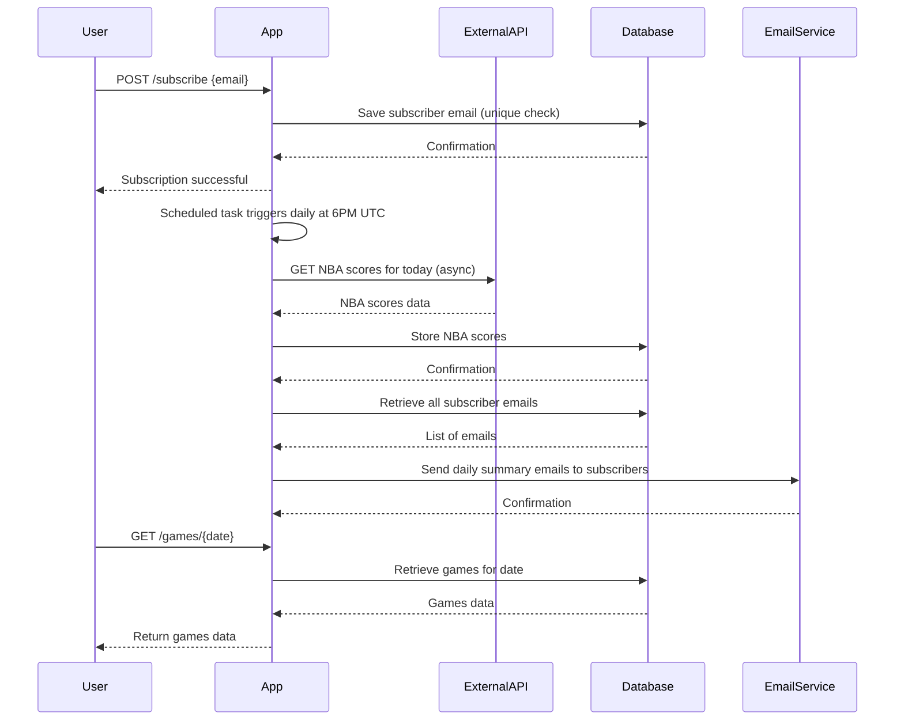

# Functional Requirements and API Design

## API Endpoints

### 1. Subscribe User  
**POST /subscribe**  
- Description: Adds a user email to the subscription list to receive daily NBA scores notifications.  
- Request:  
```json
{
  "email": "user@example.com"
}
```  
- Response:  
```json
{
  "message": "Subscription successful",
  "email": "user@example.com"
}
```  
- Business Logic: Validate email, enforce unique subscriptions, and add new subscriber.

---

### 2. Trigger Data Fetch and Notify  
**POST /fetch-and-notify**  
- Description: Manually trigger the fetching of NBA scores for a specified date from the external API, store them, and send notifications to all subscribers.  
- Request:  
```json
{
  "date": "YYYY-MM-DD"
}
```  
- Response:  
```json
{
  "message": "Data fetched and notifications sent for date YYYY-MM-DD"
}
```  
- Business Logic: Fetch data asynchronously from external API, save to DB, send emails to subscribers.

---

### 3. Get All Subscribers  
**GET /subscribers**  
- Description: Retrieve the list of all subscribed emails.  
- Response:  
```json
{
  "subscribers": [
    "user1@example.com",
    "user2@example.com"
  ]
}
```

---

### 4. Get All Games  
**GET /games/all**  
- Description: Retrieve all NBA game data stored in the system. Pagination and filtering may be applied.  
- Response:  
```json
{
  "games": [
    {
      "gameId": 123,
      "date": "YYYY-MM-DD",
      "homeTeam": "Team A",
      "awayTeam": "Team B",
      "homeScore": 100,
      "awayScore": 98
    }
  ],
  "pagination": {
    "page": 1,
    "pageSize": 20,
    "totalPages": 5
  }
}
```

---

### 5. Get Games by Date  
**GET /games/{date}**  
- Description: Retrieve NBA games played on a specific date.  
- Response:  
```json
{
  "date": "YYYY-MM-DD",
  "games": [
    {
      "gameId": 123,
      "homeTeam": "Team A",
      "awayTeam": "Team B",
      "homeScore": 100,
      "awayScore": 98
    }
  ]
}
```

---

## User-App Interaction Sequence Diagram



---

## System Components and Workflow Diagram

```mermaid
graph TD
    Scheduler[Scheduler (6PM UTC)] -->|Trigger| FetchService[Fetch & Store NBA Scores]
    FetchService --> ExternalAPI[External NBA API]
    FetchService --> Database[Game Data Storage]
    FetchService --> NotifyService[Notification Service]
    NotifyService --> Database[Subscribers Storage]
    NotifyService --> EmailService[Email Delivery]

    User -->|POST /subscribe| Database
    User -->|GET /subscribers| Database
    User -->|GET /games/all or /games/{date}| Database
    User -->|POST /fetch-and-notify| FetchService
```