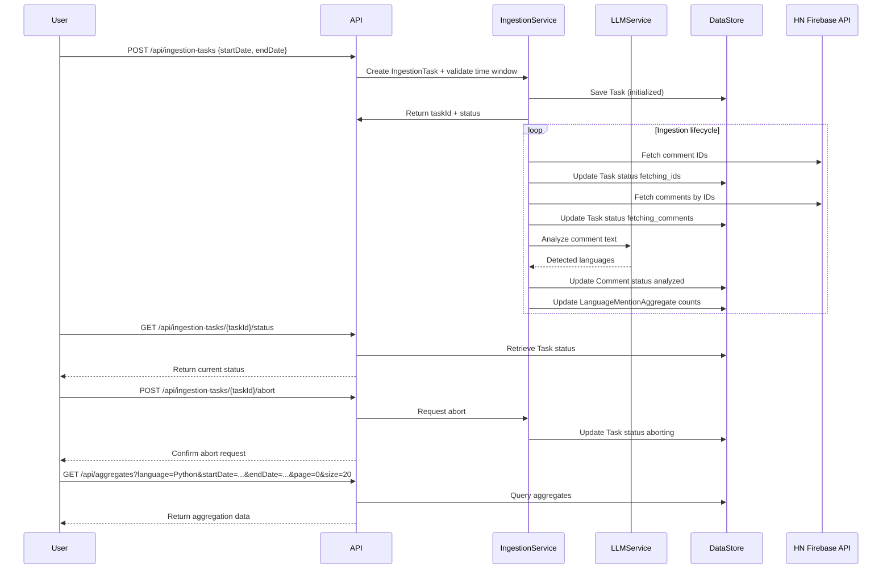
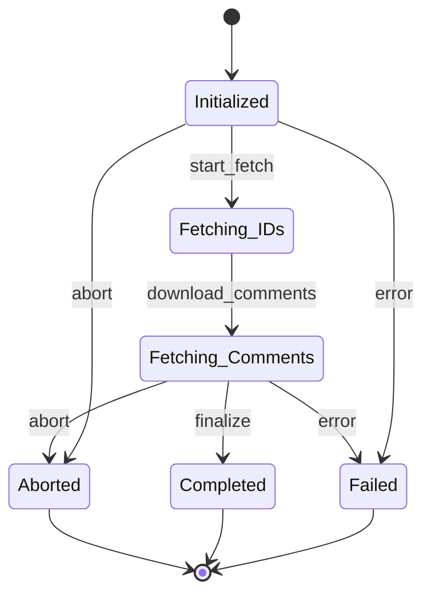

```markdown
# Functional Requirements and API Design

## API Endpoints

### 1. Create Ingestion Task  
**POST** `/api/ingestion-tasks`  
- Description: Creates a new CommentIngestionTask to ingest comments within a specified time window. Validates time window against max span (configured in application properties).  
- Request Body (YAML/JSON compatible):
```json
{
  "startDate": "2022-01-01T00:00:00Z",
  "endDate": "2023-01-01T00:00:00Z"
}
```
- Response Body:
```json
{
  "taskId": "uuid",
  "status": "initialized",
  "message": "Ingestion task created and started"
}
```
- Error Response (if time span exceeded): HTTP 400 with  
```json
{
  "code": "TIME_SPAN_EXCEEDED",
  "message": "The requested time window exceeds the maximum allowed span."
}
```

---

### 2. Get Ingestion Task Status  
**GET** `/api/ingestion-tasks/{taskId}/status`  
- Description: Retrieves current status of ingestion task.  
- Response Body:
```json
{
  "taskId": "uuid",
  "status": "fetching_comments",
  "progress": 45
}
```

---

### 3. Abort Ingestion Task  
**POST** `/api/ingestion-tasks/{taskId}/abort`  
- Description: Requests asynchronous abort of ingestion task. Returns job ID and confirmation.  
- Response Body:
```json
{
  "taskId": "uuid",
  "status": "aborting",
  "message": "Abort request accepted"
}
```

---

### 4. Query Language Mention Aggregates  
**GET** `/api/aggregates`  
- Description: Retrieves aggregated mention frequency results filtered by language and date range with pagination.  
- Query Parameters:
  - `language` (required)  
  - `startDate` (optional)  
  - `endDate` (optional)  
  - `page` (default 0)  
  - `size` (default 20)  
- Response Body:
```json
{
  "content": [
    {
      "language": "Python",
      "timeSlice": "2023-01-01",
      "mentionCount": 123
    }
  ],
  "page": 0,
  "size": 20,
  "totalElements": 100,
  "totalPages": 5
}
```

---

### 5. Analyze Comment Text (LLM Invocation)  
**POST** `/api/comments/analyze`  
- Description: Accepts comment text and returns detected languages using an LLM. (Used internally in ingestion workflow)  
- Request Body:
```json
{
  "commentText": "I love Python and Rust!"
}
```
- Response Body:
```json
{
  "detectedLanguages": ["Python", "Rust"]
}
```

---

## Mermaid Sequence Diagram: User Interaction Flow



---

## Mermaid Journey Diagram: Ingestion Task Lifecycle


```