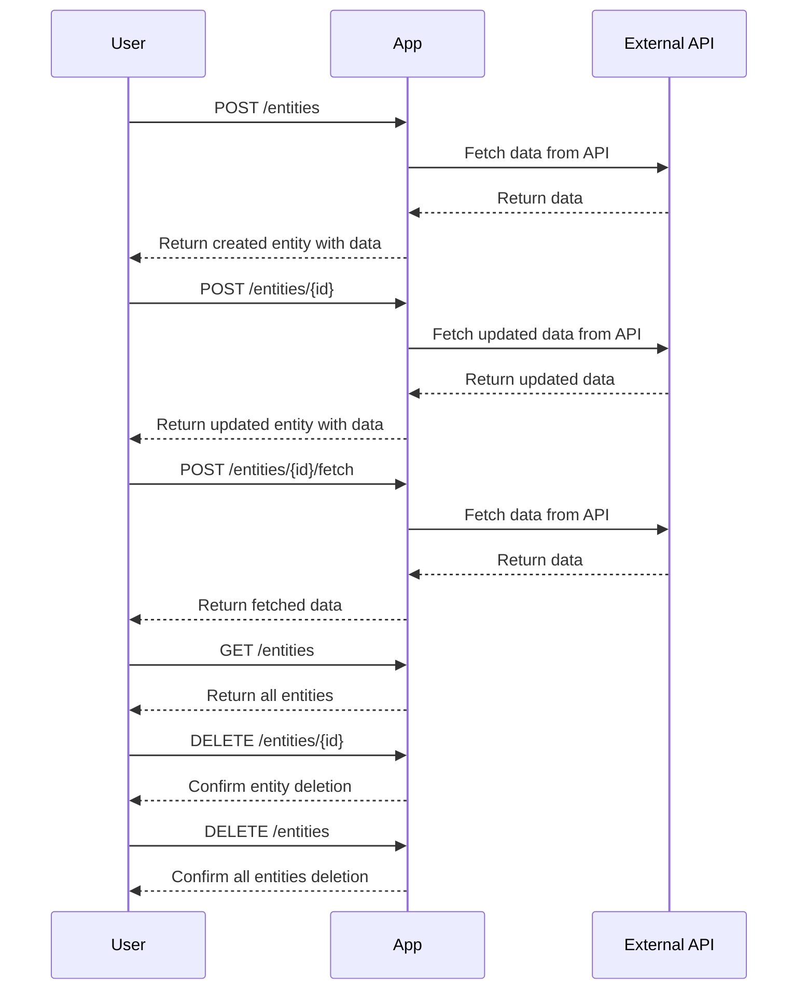

# Final Version of Functional Requirements for Data Fetching Application

## API Endpoints

### 1. Create Entity
- **Endpoint**: `/entities`
- **Method**: `POST`
- **Request Format**: 
  ```json
  {
    "api_url": "https://example.com/api/data"
  }
  ```
- **Response Format**: 
  ```json
  {
    "id": "entity_id",
    "api_url": "https://example.com/api/data",
    "fetched_data": null,
    "fetched_at": null
  }
  ```
- **Description**: Creates a new entity with the provided API URL and triggers data fetching.

### 2. Update Entity
- **Endpoint**: `/entities/{id}`
- **Method**: `POST`
- **Request Format**: 
  ```json
  {
    "api_url": "https://example.com/api/data"
  }
  ```
- **Response Format**: 
  ```json
  {
    "id": "entity_id",
    "api_url": "https://example.com/api/data",
    "fetched_data": "data",
    "fetched_at": "timestamp"
  }
  ```
- **Description**: Updates the entity's API URL and triggers data fetching.

### 3. Fetch Data Manually
- **Endpoint**: `/entities/{id}/fetch`
- **Method**: `POST`
- **Response Format**: 
  ```json
  {
    "id": "entity_id",
    "fetched_data": "data",
    "fetched_at": "timestamp"
  }
  ```
- **Description**: Manually triggers data fetching for the specified entity.

### 4. Get All Entities
- **Endpoint**: `/entities`
- **Method**: `GET`
- **Response Format**: 
  ```json
  [
    {
      "id": "entity_id",
      "api_url": "https://example.com/api/data",
      "fetched_data": "data",
      "fetched_at": "timestamp"
    },
    ...
  ]
  ```
- **Description**: Retrieves all entities stored in the system.

### 5. Delete Single Entity
- **Endpoint**: `/entities/{id}`
- **Method**: `DELETE`
- **Response Format**: 
  ```json
  {
    "message": "Entity deleted successfully"
  }
  ```
- **Description**: Deletes a specific entity by ID.

### 6. Delete All Entities
- **Endpoint**: `/entities`
- **Method**: `DELETE`
- **Response Format**: 
  ```json
  {
    "message": "All entities deleted successfully"
  }
  ```
- **Description**: Deletes all entities in the system.

## User-App Interaction Diagram



This document outlines the confirmed functional requirements and provides a visual representation of the interaction between the user and the application.