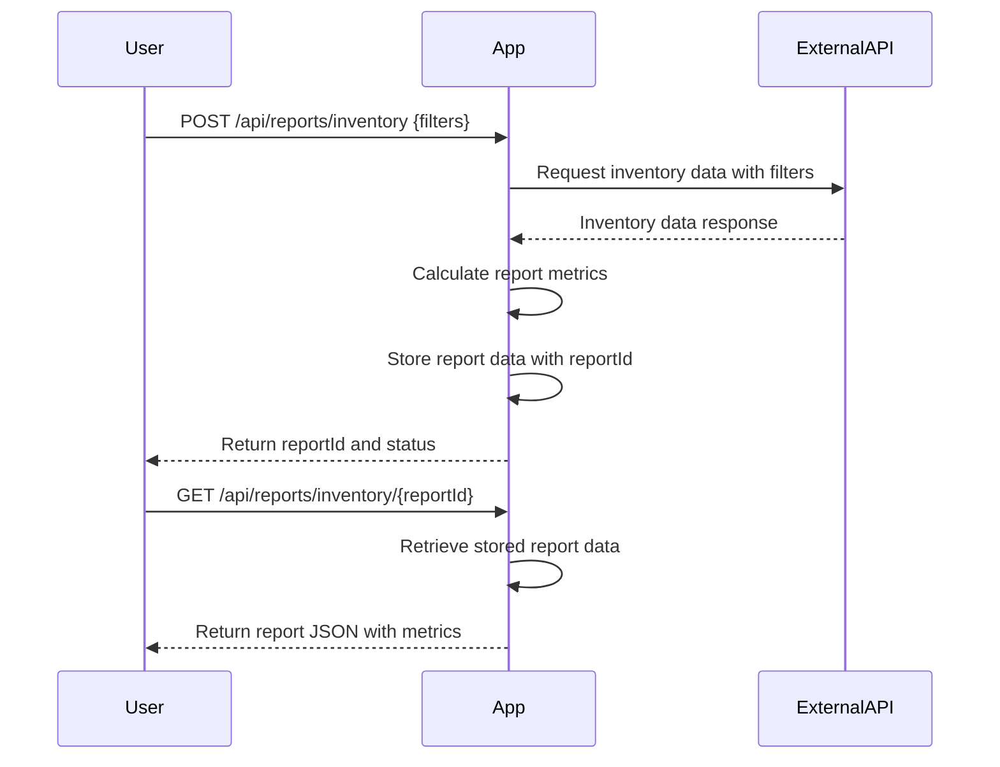

# Functional Requirements for Inventory Report Application

## API Endpoints

### 1. Generate Inventory Report  
**Endpoint:** `POST /api/reports/inventory`  
**Description:**  
Invokes the external SwaggerHub API to retrieve inventory data (with optional filters), performs calculations (total items, average price, total value, etc.), and stores the generated report in the application database for later retrieval.  

**Request Body (JSON):**  
```json
{
  "filters": {
    "category": "string",         // optional
    "dateRange": {                // optional
      "from": "YYYY-MM-DD",
      "to": "YYYY-MM-DD"
    }
  }
}
```

**Response Body (JSON):**  
```json
{
  "reportId": "string",
  "status": "SUCCESS | FAILURE",
  "message": "string"
}
```

---

### 2. Retrieve Generated Report  
**Endpoint:** `GET /api/reports/inventory/{reportId}`  
**Description:**  
Returns the generated report data for the given `reportId`.  

**Response Body (JSON):**  
```json
{
  "reportId": "string",
  "totalItems": 123,
  "averagePrice": 45.67,
  "totalValue": 5600.89,
  "otherStatistics": {
    "categoryStats": {
      "categoryName": {
        "count": 10,
        "averagePrice": 50.0
      }
    }
  },
  "generatedAt": "YYYY-MM-DDTHH:mm:ssZ"
}
```

---

# User-App Interaction Sequence



---

# Summary

- **POST /api/reports/inventory**: triggers external API call, calculations, and report storage.  
- **GET /api/reports/inventory/{reportId}**: fetches generated report by ID.  
- All business logic and external calls happen in POST endpoint.  
- Responses are JSON formatted for easy frontend consumption.