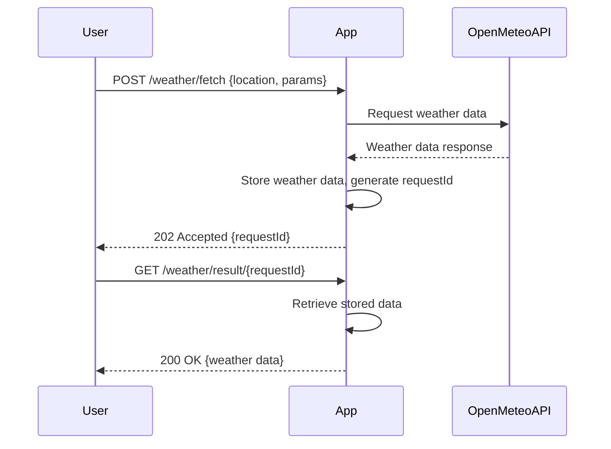

# Functional Requirements and API Design for Weather Data App

## API Endpoints

### 1. Fetch Weather Data (POST /weather/fetch)

- **Description:** Receives a request with location and parameters, calls the Open-Meteo API, processes the data, and stores results internally.
- **Request Body (JSON):**
  ```json
  {
    "latitude": 52.52,
    "longitude": 13.405,
    "parameters": ["temperature", "precipitation"],
    "forecast_days": 7
  }
  ```
- **Response (JSON):**
  ```json
  {
    "requestId": "123e4567-e89b-12d3-a456-426614174000",
    "status": "processing"
  }
  ```

### 2. Get Weather Data Result (GET /weather/result/{requestId})

- **Description:** Returns the weather data result for a previously fetched request.
- **Path Parameter:**
  - `requestId`: the ID obtained from the POST fetch request.
- **Response (JSON):**
  ```json
  {
    "requestId": "123e4567-e89b-12d3-a456-426614174000",
    "latitude": 52.52,
    "longitude": 13.405,
    "parameters": {
      "temperature": [15.3, 16.1, 14.8, ...],
      "precipitation": [0, 0.2, 0, ...]
    },
    "forecast_days": 7,
    "timestamp": "2024-06-01T12:00:00Z"
  }
  ```

---

## Business Logic Overview

- `POST /weather/fetch` triggers a workflow:
  - Validate input.
  - Call Open-Meteo API with given parameters.
  - Parse and store the response internally.
  - Return a unique `requestId` to client.
- `GET /weather/result/{requestId}` retrieves stored results by `requestId`.

---

## User-App Interaction Sequence Diagram

