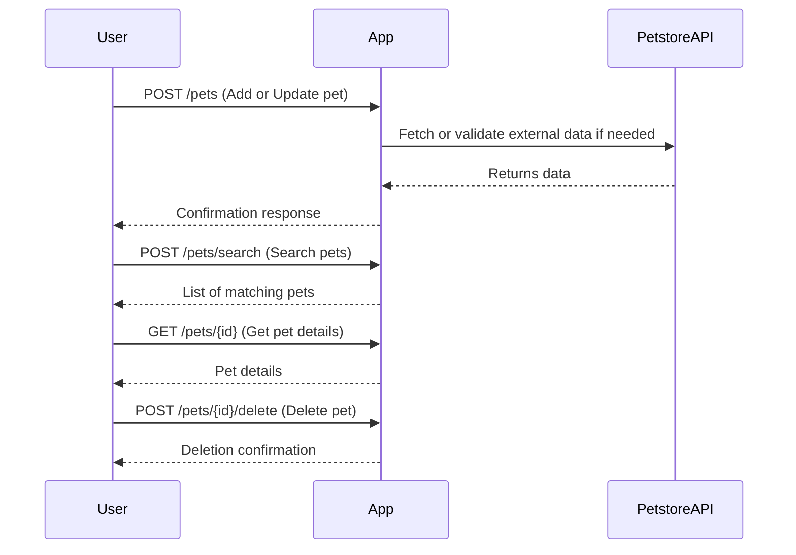
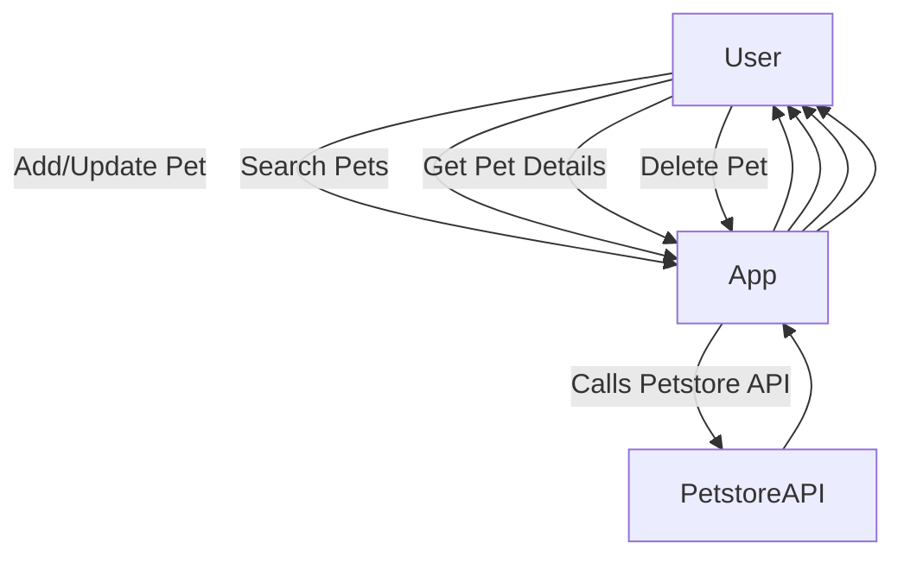

```markdown
# Functional Requirements for Purrfect Pets API

## API Endpoints

### 1. Add or Update Pets (POST /pets)
- **Purpose:** Ingest or update pet data from external Petstore API or internal data.
- **Request Body:**
```json
{
  "id": "optional for new pets",
  "name": "string",
  "category": "string",
  "status": "available | pending | sold",
  "tags": ["string"],
  "photoUrls": ["string"]
}
```
- **Response:**
```json
{
  "success": true,
  "petId": "string",
  "message": "Pet added/updated successfully"
}
```

### 2. Search or Filter Pets (POST /pets/search)
- **Purpose:** Query pets by filters such as category, status, name.
- **Request Body:**
```json
{
  "category": "optional string",
  "status": "optional string",
  "name": "optional string"
}
```
- **Response:**
```json
[
  {
    "id": "string",
    "name": "string",
    "category": "string",
    "status": "string",
    "tags": ["string"],
    "photoUrls": ["string"]
  },
  ...
]
```

### 3. Get Pet Details (GET /pets/{id})
- **Purpose:** Retrieve pet info by ID.
- **Response:**
```json
{
  "id": "string",
  "name": "string",
  "category": "string",
  "status": "string",
  "tags": ["string"],
  "photoUrls": ["string"]
}
```

### 4. Delete Pet (POST /pets/{id}/delete)
- **Purpose:** Remove pet by ID.
- **Response:**
```json
{
  "success": true,
  "message": "Pet deleted successfully"
}
```

---

## Mermaid Sequence Diagram for User-App Interaction




```