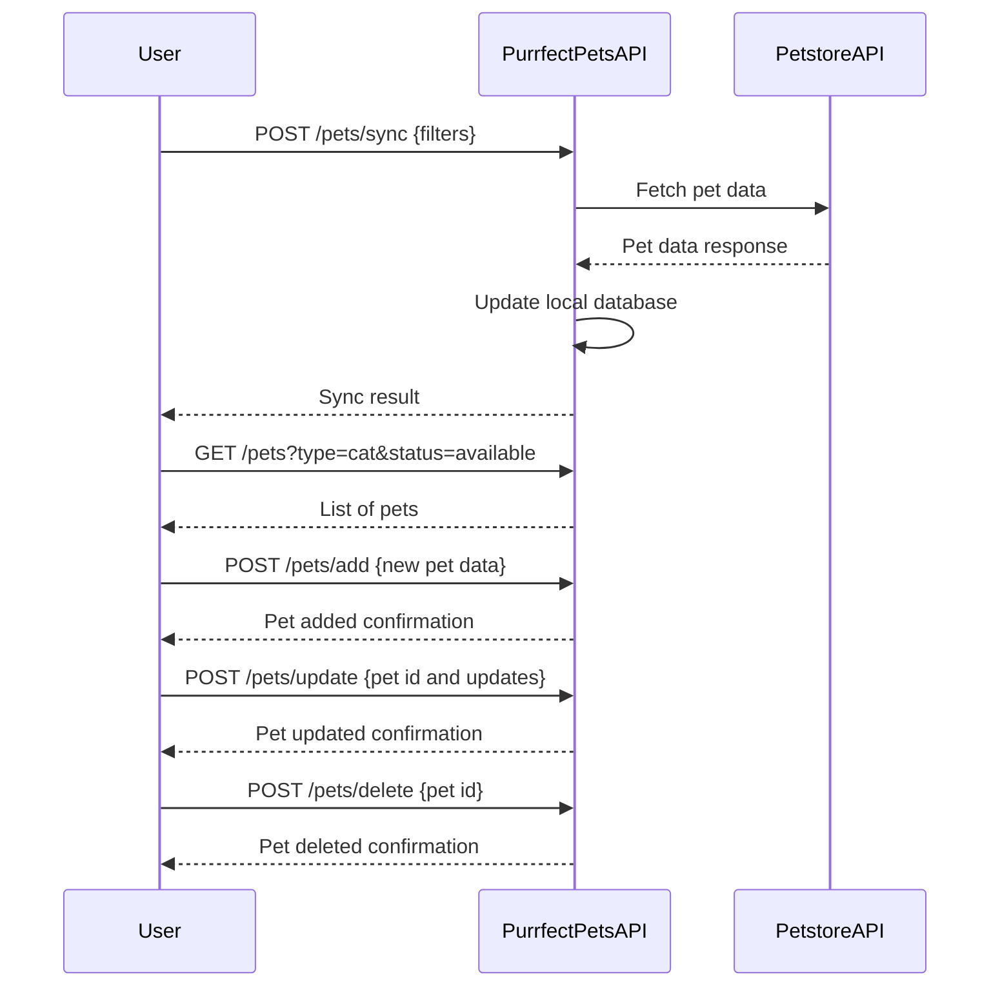

# Purrfect Pets API - Functional Requirements

## API Endpoints

### 1. POST /pets/sync  
**Description:** Sync and update local pet data from the external Petstore API.  
**Request:**  
```json
{
  "source": "petstore",
  "filters": {
    "type": "string (optional)",
    "status": "string (optional)"
  }
}
```  
**Response:**  
```json
{
  "syncedCount": "integer",
  "message": "string"
}
```

---

### 2. GET /pets  
**Description:** Retrieve a list of pets stored in the local app database. Supports optional query parameters for filtering.  
**Query Parameters:**  
- `type` (optional): filter by pet type (e.g., cat, dog)  
- `status` (optional): filter by adoption status (e.g., available, adopted)  
**Response:**  
```json
[
  {
    "id": "string",
    "name": "string",
    "type": "string",
    "age": "integer",
    "status": "string"
  }
]
```

---

### 3. POST /pets/add  
**Description:** Add a new pet entry to the local database.  
**Request:**  
```json
{
  "name": "string",
  "type": "string",
  "age": "integer",
  "status": "string"
}
```  
**Response:**  
```json
{
  "id": "string",
  "message": "Pet added successfully"
}
```

---

### 4. POST /pets/update  
**Description:** Update existing pet details.  
**Request:**  
```json
{
  "id": "string",
  "name": "string (optional)",
  "type": "string (optional)",
  "age": "integer (optional)",
  "status": "string (optional)"
}
```  
**Response:**  
```json
{
  "message": "Pet updated successfully"
}
```

---

### 5. POST /pets/delete  
**Description:** Delete a pet by ID.  
**Request:**  
```json
{
  "id": "string"
}
```  
**Response:**  
```json
{
  "message": "Pet deleted successfully"
}
```

---

# User-App Interaction Sequence Diagram

