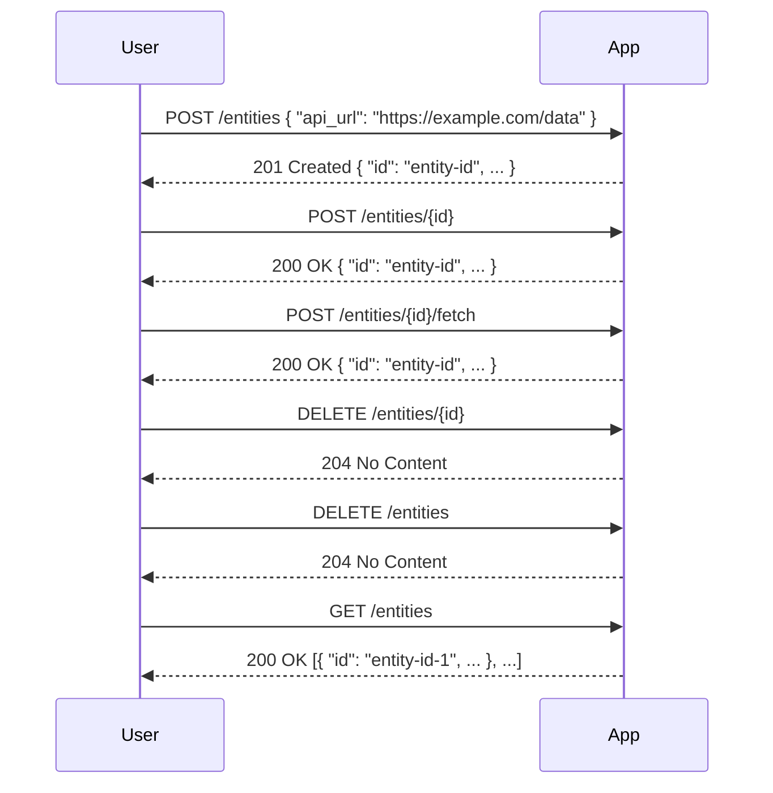
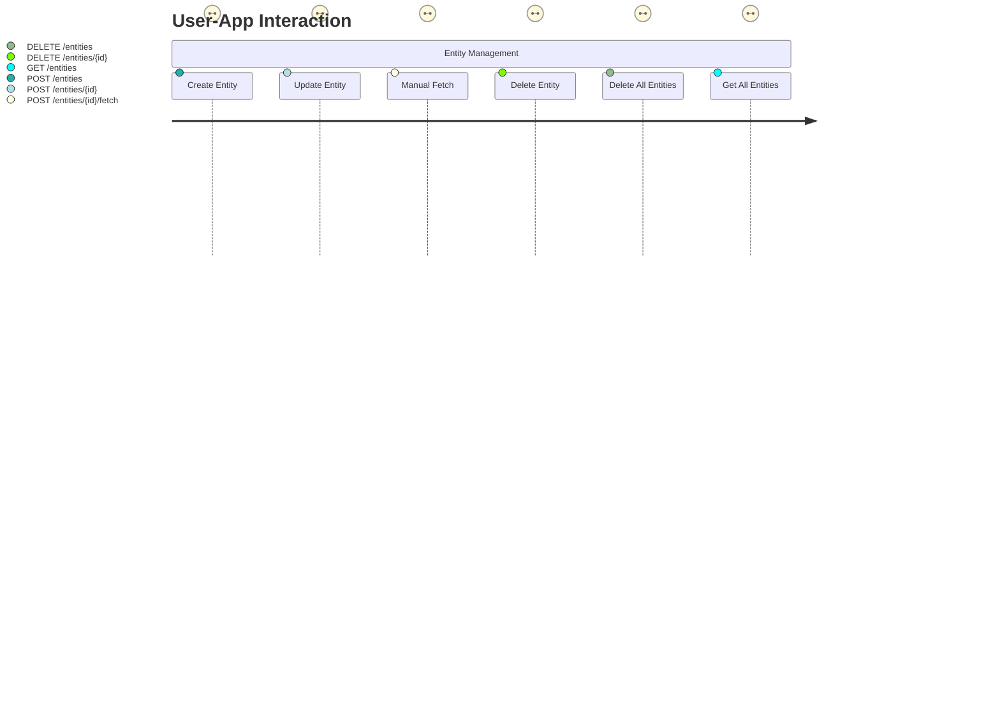

# Final Functional Requirements for Data Fetching App

## API Endpoints

### 1. Create Entity
- **Endpoint:** `/entities`
- **Method:** `POST`
- **Request Format:**
  ```json
  {
    "api_url": "https://example.com/data"
  }
  ```
- **Response Format:**
  ```json
  {
    "id": "entity-id",
    "api_url": "https://example.com/data",
    "fetched_data": null,
    "fetched_at": null
  }
  ```
- **Description:** Creates a new entity, persists the API URL, and automatically fetches data from the provided URL.

### 2. Update Entity
- **Endpoint:** `/entities/{id}`
- **Method:** `POST`
- **Request Format:**
  ```json
  {
    "api_url": "https://example.com/new-data"
  }
  ```
- **Response Format:**
  ```json
  {
    "id": "entity-id",
    "api_url": "https://example.com/new-data",
    "fetched_data": "new-data-response",
    "fetched_at": "timestamp"
  }
  ```
- **Description:** Updates the API URL of an existing entity and automatically fetches data from the new URL.

### 3. Manual Data Fetch
- **Endpoint:** `/entities/{id}/fetch`
- **Method:** `POST`
- **Request Format:** (empty)
- **Response Format:**
  ```json
  {
    "id": "entity-id",
    "api_url": "https://example.com/data",
    "fetched_data": "fetched-data-response",
    "fetched_at": "timestamp"
  }
  ```
- **Description:** Manually triggers data fetching for the specified entity.

### 4. Delete Entity
- **Endpoint:** `/entities/{id}`
- **Method:** `DELETE`
- **Response Format:** `204 No Content`
- **Description:** Deletes a single entity by its ID.

### 5. Delete All Entities
- **Endpoint:** `/entities`
- **Method:** `DELETE`
- **Response Format:** `204 No Content`
- **Description:** Deletes all entities.

### 6. Get All Entities
- **Endpoint:** `/entities`
- **Method:** `GET`
- **Response Format:**
  ```json
  [
    {
      "id": "entity-id-1",
      "api_url": "https://example.com/data1",
      "fetched_data": "data1-response",
      "fetched_at": "timestamp1"
    },
    {
      "id": "entity-id-2",
      "api_url": "https://example.com/data2",
      "fetched_data": "data2-response",
      "fetched_at": "timestamp2"
    }
  ]
  ```
- **Description:** Retrieves all entities.

## Visual Representation



