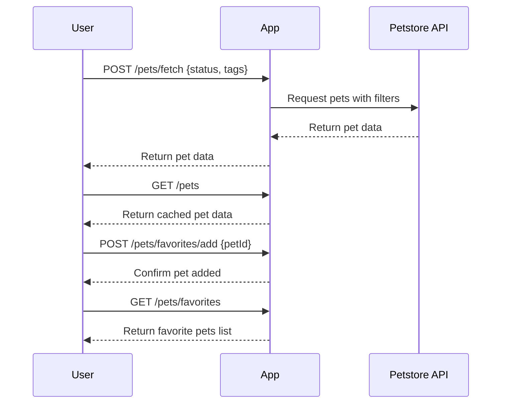

# Purrfect Pets API Functional Requirements

## API Endpoints

### 1. POST /pets/fetch  
**Description:** Fetch pet data from the external Petstore API, optionally filtered by parameters.  
**Request:**  
```json
{
  "status": "available|pending|sold",   // optional filter
  "tags": ["string"]                   // optional filter by tags
}
```  
**Response:**  
```json
{
  "pets": [
    {
      "id": 1,
      "name": "Fluffy",
      "category": "Cat",
      "status": "available",
      "tags": ["cute", "small"],
      "photoUrls": ["http://example.com/photo1.jpg"]
    }
  ]
}
```

---

### 2. GET /pets  
**Description:** Retrieve the last fetched or cached list of pets stored in the application.  
**Response:**  
```json
{
  "pets": [
    {
      "id": 1,
      "name": "Fluffy",
      "category": "Cat",
      "status": "available",
      "tags": ["cute", "small"],
      "photoUrls": ["http://example.com/photo1.jpg"]
    }
  ]
}
```

---

### 3. POST /pets/favorites/add  
**Description:** Add a pet to the user's favorites list.  
**Request:**  
```json
{
  "petId": 1
}
```  
**Response:**  
```json
{
  "message": "Pet added to favorites",
  "petId": 1
}
```

---

### 4. GET /pets/favorites  
**Description:** Retrieve the user's favorite pets list.  
**Response:**  
```json
{
  "favorites": [
    {
      "id": 1,
      "name": "Fluffy",
      "category": "Cat",
      "status": "available"
    }
  ]
}
```

---

## Business Logic Notes

- All external Petstore API calls are invoked in **POST** endpoints (e.g., `/pets/fetch`).
- **GET** endpoints serve only cached or previously fetched data.
- Favorites management is local to the application and does not call external API.

---

## User-App Interaction Sequence Diagram

