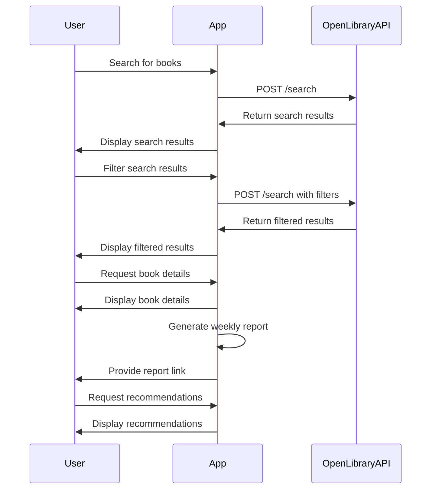

# Book Search and Recommendation Application Functional Requirements

## API Endpoints

### 1. Search Books
- **Endpoint**: `/api/books/search`
- **Method**: `POST`
- **Description**: Fetch search results from the Open Library API based on user queries.
- **Request Format**:
  ```json
  {
    "query": "string",
    "filters": {
      "genre": "string",
      "publication_year": "number",
      "author": "string"
    }
  }
  ```
- **Response Format**:
  ```json
  {
    "books": [
      {
        "title": "string",
        "author": "string",
        "cover_image": "url",
        "genre": "string",
        "publication_year": "number"
      }
    ]
  }
  ```

### 2. Get Book Details
- **Endpoint**: `/api/books/{bookId}`
- **Method**: `GET`
- **Description**: Retrieve detailed information about a specific book.
- **Response Format**:
  ```json
  {
    "title": "string",
    "author": "string",
    "cover_image": "url",
    "description": "string",
    "genre": "string",
    "publication_year": "number"
  }
  ```

### 3. Generate Weekly Reports
- **Endpoint**: `/api/reports/weekly`
- **Method**: `POST`
- **Description**: Generate a report on the most searched books and user preferences.
- **Response Format**:
  ```json
  {
    "report": "url"
  }
  ```

### 4. Personalized Recommendations
- **Endpoint**: `/api/recommendations`
- **Method**: `POST`
- **Description**: Provide personalized book recommendations based on user search history.
- **Request Format**:
  ```json
  {
    "userId": "string"
  }
  ```
- **Response Format**:
  ```json
  {
    "recommendations": [
      {
        "title": "string",
        "author": "string",
        "cover_image": "url",
        "genre": "string",
        "publication_year": "number"
      }
    ]
  }
  ```

## User-App Interaction Diagram



This document outlines the key functional requirements for your Book Search and Recommendation Application. Feel free to adjust any details to better fit your project's needs!