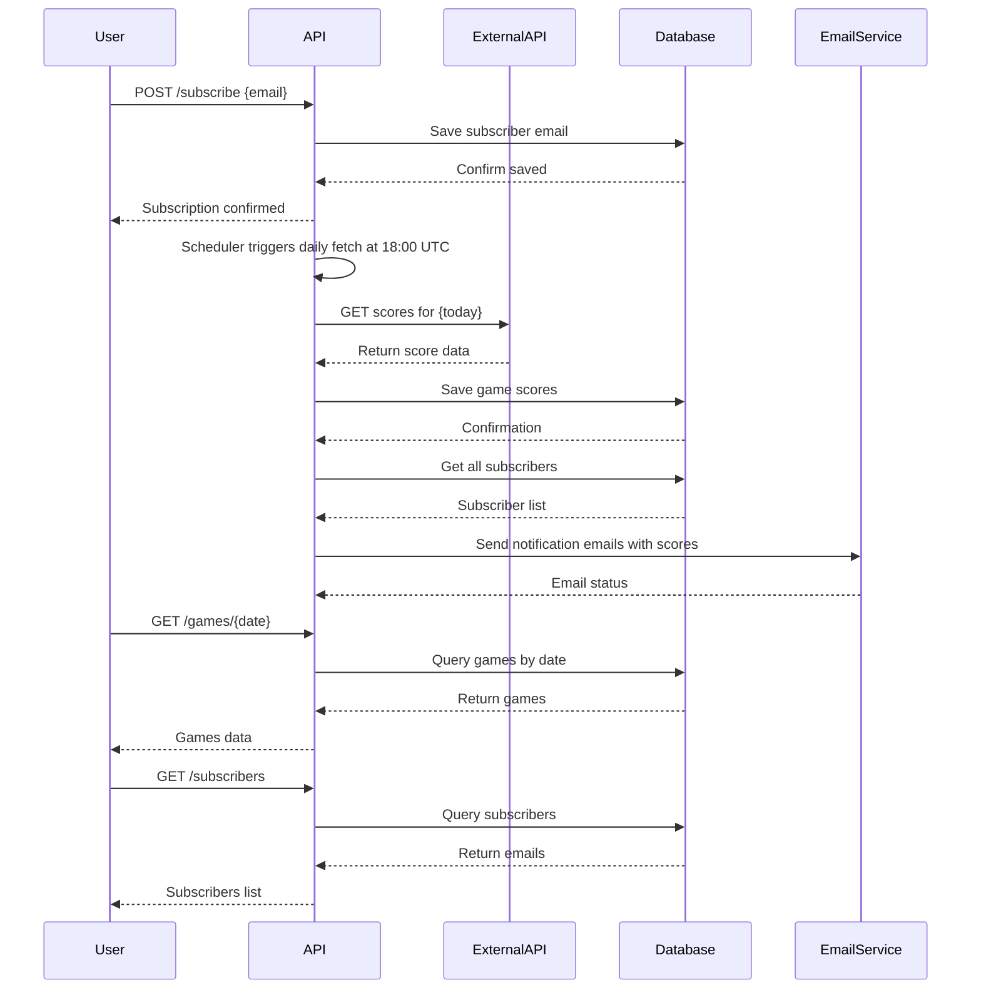
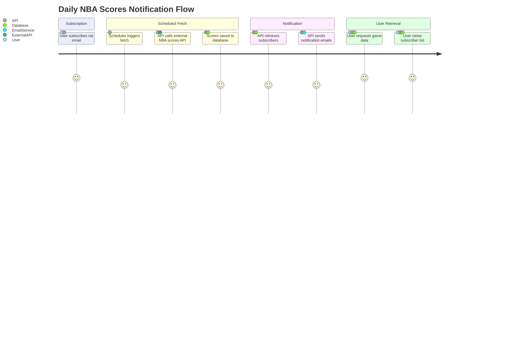

# Functional Requirements and API Design

## API Endpoints

### 1. POST /fetch-scores  
**Description:**  
Triggers fetching NBA scores for a specific date from the external API, saves data locally, and sends notifications to subscribers.  
**Request Body:**  
```json
{
  "date": "YYYY-MM-DD"
}
```  
**Response:**  
```json
{
  "status": "success",
  "fetchedDate": "YYYY-MM-DD",
  "gamesCount": 12
}
```  
**Notes:**  
- This endpoint handles external API calls asynchronously.  
- It saves fetched data and triggers email notifications.

---

### 2. POST /subscribe  
**Description:**  
Allows users to subscribe by providing their email to receive daily notifications.  
**Request Body:**  
```json
{
  "email": "user@example.com"
}
```  
**Response:**  
```json
{
  "status": "subscribed",
  "email": "user@example.com"
}
```  
**Notes:**  
- Enforces unique subscription per email.

---

### 3. GET /subscribers  
**Description:**  
Retrieves a list of all subscribed email addresses.  
**Response:**  
```json
{
  "subscribers": [
    "user1@example.com",
    "user2@example.com"
  ]
}
```

---

### 4. GET /games/all  
**Description:**  
Retrieves all NBA games stored in the system, supports pagination.  
**Query Parameters:**  
- `page` (optional, default=0)  
- `size` (optional, default=20)  
**Response:**  
```json
{
  "page": 0,
  "size": 20,
  "totalPages": 5,
  "games": [
    {
      "date": "YYYY-MM-DD",
      "homeTeam": "Lakers",
      "awayTeam": "Warriors",
      "homeScore": 110,
      "awayScore": 102
    }
  ]
}
```

---

### 5. GET /games/{date}  
**Description:**  
Retrieves all NBA games for the specified date (`YYYY-MM-DD`).  
**Response:**  
```json
{
  "date": "YYYY-MM-DD",
  "games": [
    {
      "homeTeam": "Lakers",
      "awayTeam": "Warriors",
      "homeScore": 110,
      "awayScore": 102
    }
  ]
}
```

---

# Mermaid Sequence Diagram: User & System Interaction



---

# Mermaid Journey Diagram: Daily NBA Scores Notification Flow

