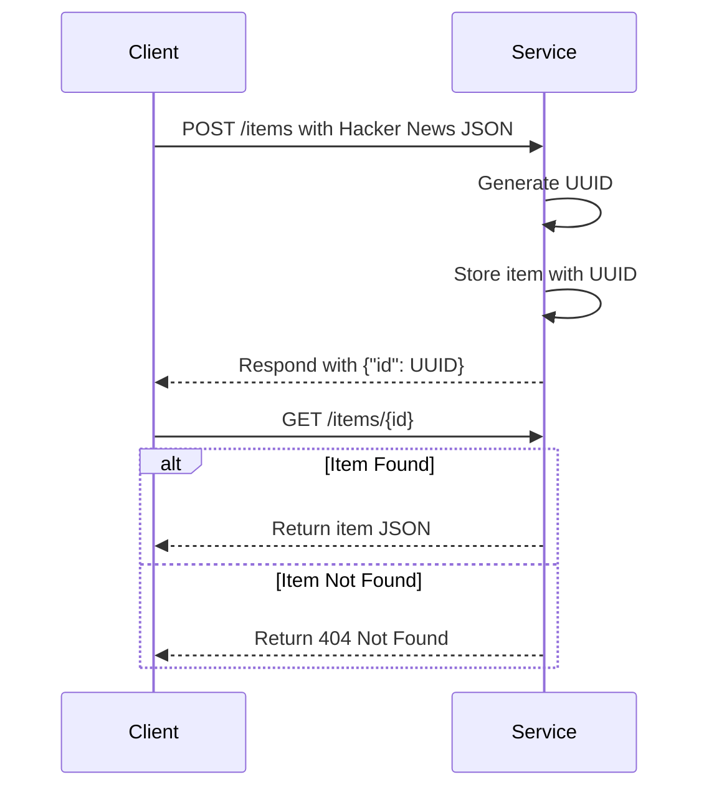
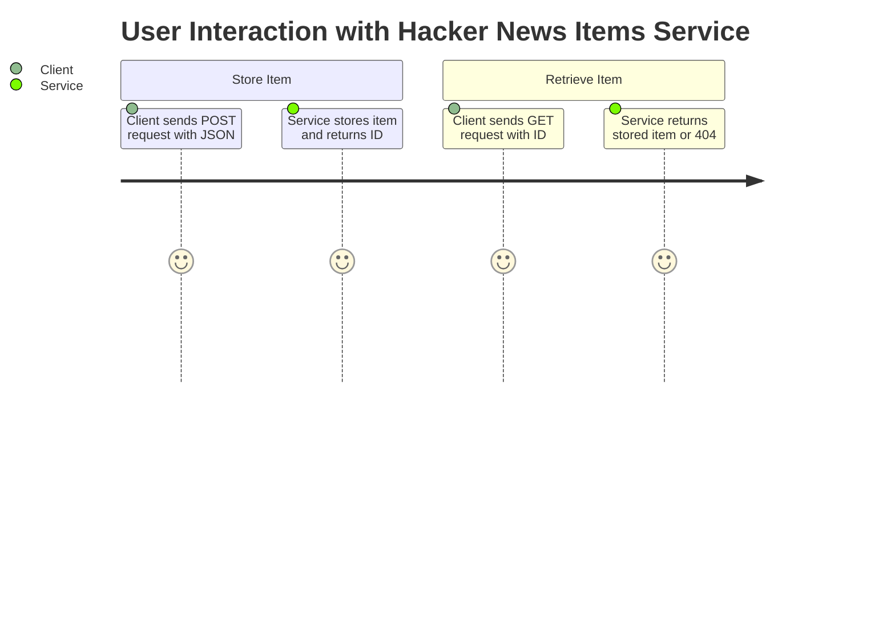

# Functional Requirements for Hacker News Items Service

## API Endpoints

### 1. POST `/items`
- **Purpose:** Accepts a Hacker News item in JSON format, generates a UUID as the item ID, stores it in a persistent datastore, and returns the ID.
- **Request Body:**  
  Any valid JSON object representing a Hacker News item.
  
- **Response:**  
  ```json
  {
    "id": "generated-uuid-string"
  }
  ```
- **Business Logic:**  
  - Generate a UUID for the item.
  - Store the item JSON with the generated ID.
  - No external data retrieval or additional processing.

---

### 2. GET `/items/{id}`
- **Purpose:** Retrieve a stored Hacker News item by ID.
- **Request Parameters:**  
  - `id` (path parameter): The UUID of the stored item.
  
- **Response:**  
  - **200 OK:** Returns the stored JSON item.
  - **404 Not Found:** If no item exists with the given ID.

---

## Mermaid Sequence Diagram



---

## Mermaid User Journey Diagram

