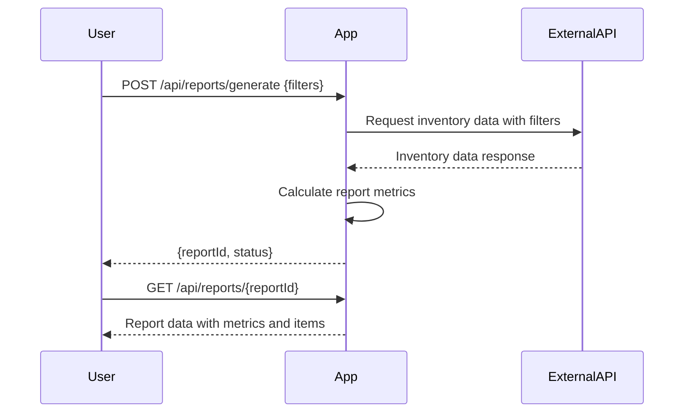
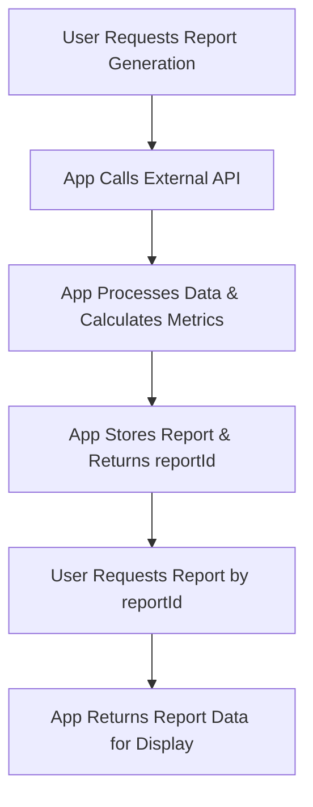

```markdown
# Functional Requirements for Inventory Reporting Application

## API Endpoints

### 1. POST /api/reports/generate
- **Purpose:** Trigger report generation by fetching inventory data from the external SwaggerHub API, perform calculations, and store the results.
- **Request Body:**
```json
{
  "filters": {
    "category": "string",          // optional
    "minPrice": "number",          // optional
    "maxPrice": "number",          // optional
    "dateFrom": "string (ISO8601)", // optional
    "dateTo": "string (ISO8601)"    // optional
  }
}
```
- **Response Body:**
```json
{
  "reportId": "string",
  "status": "IN_PROGRESS | COMPLETED | FAILED",
  "message": "string (optional error or status message)"
}
```

### 2. GET /api/reports/{reportId}
- **Purpose:** Retrieve the generated report results by report ID.
- **Response Body:**
```json
{
  "reportId": "string",
  "generatedAt": "string (ISO8601)",
  "metrics": {
    "totalItems": "number",
    "averagePrice": "number",
    "totalValue": "number",
    "minPrice": "number",
    "maxPrice": "number"
  },
  "data": [                        // Optional detailed data for tables/charts
    {
      "itemId": "string",
      "name": "string",
      "category": "string",
      "price": "number",
      "quantity": "number"
    }
  ]
}
```

---

## Business Logic Flow

- POST `/api/reports/generate`  
  → Calls external SwaggerHub API with filters  
  → Retrieves inventory data  
  → Calculates metrics (total items, average price, total value, min/max price)  
  → Stores report with a unique reportId and status  
  → Returns reportId and status to client

- GET `/api/reports/{reportId}`  
  → Returns stored report metrics and inventory data for UI rendering

---

## User-App Interaction Sequence Diagram



---

## User Journey Diagram


```