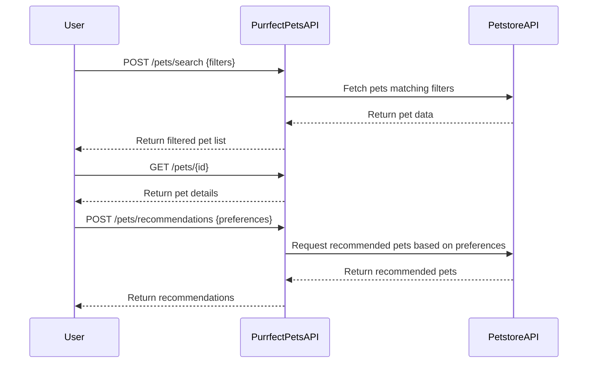

# Purrfect Pets API - Functional Requirements

## API Endpoints

### 1. POST /pets/search  
**Description:** Search pets based on filters (type, status, name, etc.) by invoking Petstore API data.  
**Request:**  
```json
{
  "type": "cat|dog|bird|all",
  "status": "available|pending|sold",
  "name": "optional string"
}
```  
**Response:**  
```json
{
  "pets": [
    {
      "id": "integer",
      "name": "string",
      "type": "string",
      "status": "string",
      "photoUrls": ["string"]
    }
  ]
}
```

### 2. GET /pets/{id}  
**Description:** Retrieve detailed pet information stored in the app (cached or saved data).  
**Response:**  
```json
{
  "id": "integer",
  "name": "string",
  "type": "string",
  "status": "string",
  "photoUrls": ["string"],
  "tags": ["string"]
}
```

### 3. POST /pets/recommendations  
**Description:** Provide fun pet recommendations based on user preferences or previous searches (business logic + external data invocation).  
**Request:**  
```json
{
  "preferredType": "cat|dog|bird|all",
  "preferredStatus": "available|pending|sold"
}
```  
**Response:**  
```json
{
  "recommendedPets": [
    {
      "id": "integer",
      "name": "string",
      "type": "string",
      "status": "string"
    }
  ]
}
```

---

## User-App Interaction Sequence

