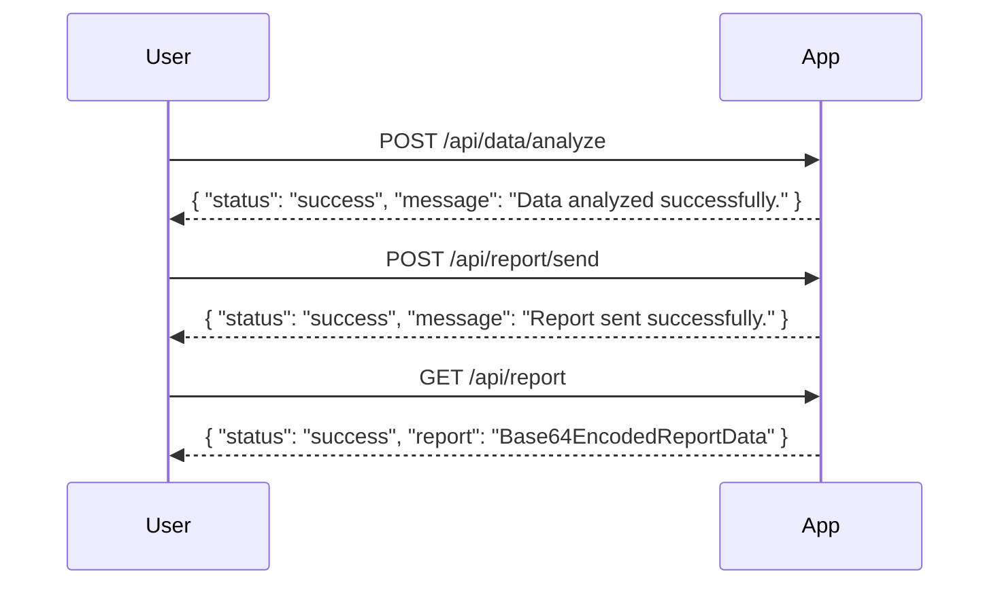

# Final Functional Requirements for the Java Spring Boot Application

## API Endpoints

### 1. Download and Analyze Data

- **Endpoint**: `/api/data/analyze`
- **Method**: `POST`
- **Description**: Downloads the CSV data from the specified URL, analyzes it, and prepares a report.
- **Request Body**:
  ```json
  {
    "csvUrl": "https://raw.githubusercontent.com/Cyoda-platform/cyoda-ai/refs/heads/ai-2.x/data/test-inputs/v1/connections/london_houses.csv"
  }
  ```
- **Response**:
  ```json
  {
    "status": "success",
    "message": "Data analyzed successfully. Report is ready."
  }
  ```

### 2. Send Report via Email

- **Endpoint**: `/api/report/send`
- **Method**: `POST`
- **Description**: Sends the generated report to the list of subscribers.
- **Request Body**:
  ```json
  {
    "reportFormat": "PDF",
    "subscribers": [
      "subscriber1@example.com",
      "subscriber2@example.com"
    ]
  }
  ```
- **Response**:
  ```json
  {
    "status": "success",
    "message": "Report sent to subscribers successfully."
  }
  ```

### 3. Retrieve Analysis Report

- **Endpoint**: `/api/report`
- **Method**: `GET`
- **Description**: Retrieves the latest analysis report.
- **Response**:
  ```json
  {
    "status": "success",
    "report": "Base64EncodedReportData"
  }
  ```

## User-App Interaction Diagram

