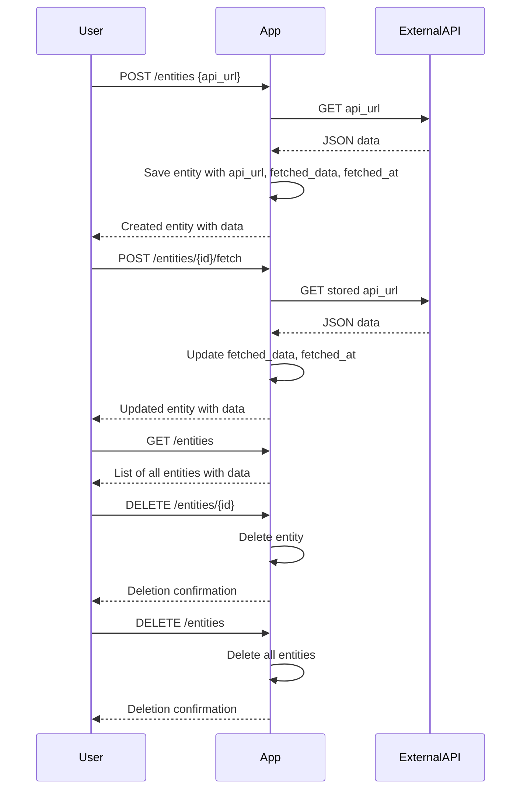

```markdown
# Functional Requirements for Data Fetching Application

## API Endpoints

### 1. Create Entity and Fetch Data  
- **Endpoint:** `POST /entities`  
- **Description:** Creates a new entity with the provided external API URL, triggers data fetching immediately, stores fetched data and timestamp.  
- **Request Body:**  
  ```json
  {
    "api_url": "<valid-external-api-url>"
  }
  ```  
- **Response:**  
  ```json
  {
    "id": "<entity-id>",
    "api_url": "<provided-url>",
    "fetched_data": { /* JSON fetched from external API */ },
    "fetched_at": "<ISO-8601-timestamp>"
  }
  ```

---

### 2. Update Entity API URL and Refetch Data  
- **Endpoint:** `POST /entities/{id}`  
- **Description:** Updates the API URL of an existing entity, triggers data fetching to update `fetched_data` and `fetched_at`.  
- **Request Body:**  
  ```json
  {
    "api_url": "<new-valid-external-api-url>"
  }
  ```  
- **Response:**  
  ```json
  {
    "id": "<entity-id>",
    "api_url": "<updated-url>",
    "fetched_data": { /* new JSON fetched from external API */ },
    "fetched_at": "<new-ISO-8601-timestamp>"
  }
  ```

---

### 3. Manual Fetch Data Trigger  
- **Endpoint:** `POST /entities/{id}/fetch`  
- **Description:** Manually triggers fetching data from the entity’s stored API URL, updates `fetched_data` and `fetched_at`.  
- **Request Body:** _(empty)_  
- **Response:**  
  ```json
  {
    "id": "<entity-id>",
    "fetched_data": { /* updated JSON fetched from external API */ },
    "fetched_at": "<updated-ISO-8601-timestamp>"
  }
  ```

---

### 4. Get All Entities  
- **Endpoint:** `GET /entities`  
- **Description:** Retrieves the list of all entities with their stored data.  
- **Response:**  
  ```json
  [
    {
      "id": "<entity-id>",
      "api_url": "<url>",
      "fetched_data": { /* JSON */ },
      "fetched_at": "<ISO-8601-timestamp>"
    },
    ...
  ]
  ```

---

### 5. Delete Single Entity  
- **Endpoint:** `DELETE /entities/{id}`  
- **Description:** Deletes an entity by its ID.  
- **Response:**  
  ```json
  {
    "message": "Entity <id> deleted successfully."
  }
  ```

---

### 6. Delete All Entities  
- **Endpoint:** `DELETE /entities`  
- **Description:** Deletes all stored entities.  
- **Response:**  
  ```json
  {
    "message": "All entities deleted successfully."
  }
  ```

---

## User-App Interaction Sequence Diagram



---

## Notes  
- All external API calls happen inside POST endpoints.  
- GET endpoints only return stored entity data, no external calls.  
- Timestamps are ISO-8601 formatted strings.  
- `fetched_data` and `api_url` fields are stored as JSON nodes internally.
```
