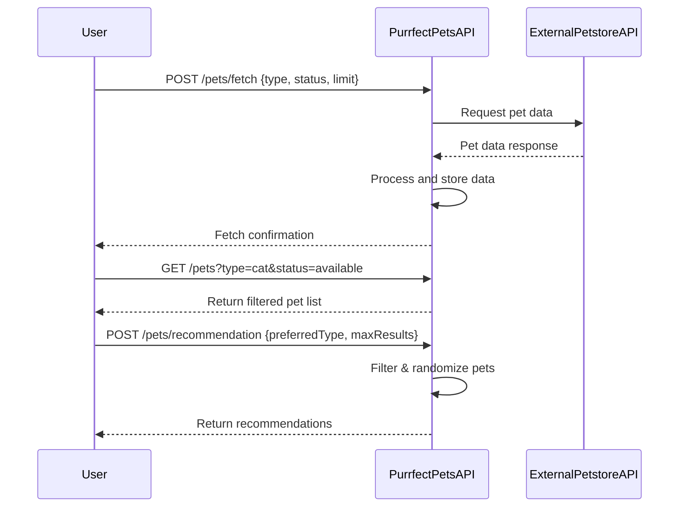

```markdown
# Functional Requirements for Purrfect Pets API

## API Endpoints

### 1. POST /pets/fetch
- **Description:** Fetch pet data from external Petstore API based on filters or criteria.
- **Request:**
  ```json
  {
    "type": "string",      // optional, e.g. "cat", "dog"
    "status": "string",    // optional, e.g. "available", "sold"
    "limit": "integer"     // optional, number of pets to fetch
  }
  ```
- **Response:**
  ```json
  {
    "fetchedCount": "integer",
    "message": "string"
  }
  ```
- **Business Logic:** Calls external Petstore API, processes and stores data internally, triggers workflows.

---

### 2. GET /pets
- **Description:** Retrieve stored pet data with optional filtering.
- **Query Parameters:**
  - `type` (optional)
  - `status` (optional)
  - `limit` (optional)
- **Response:**
  ```json
  [
    {
      "id": "integer",
      "name": "string",
      "type": "string",
      "status": "string",
      "photoUrls": ["string"]
    }
  ]
  ```

---

### 3. POST /pets/recommendation
- **Description:** Generate and return random or filtered pet recommendations based on user criteria.
- **Request:**
  ```json
  {
    "preferredType": "string",    // optional
    "maxResults": "integer"       // optional
  }
  ```
- **Response:**
  ```json
  [
    {
      "id": "integer",
      "name": "string",
      "type": "string",
      "status": "string",
      "photoUrls": ["string"]
    }
  ]
  ```
- **Business Logic:** Applies filtering and randomization logic to stored pet data.

---

## Mermaid Sequence Diagram: User Interaction with Purrfect Pets API


```