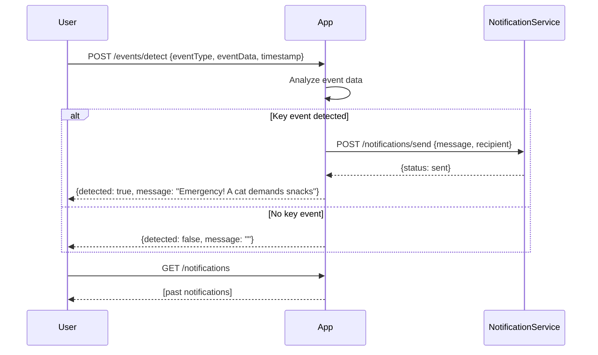

# Functional Requirements and API Design for Cat Event Detection App

## API Endpoints

### 1. POST /events/detect  
**Description:** Receive cat event data (e.g., sensor input, text messages) and process detection of key events like dramatic food requests.  
**Request Body:**  
```json
{
  "eventType": "string",      // e.g. "food_request", "meow", "scratch"
  "eventData": "string",      // raw data or description
  "timestamp": "ISO8601"      // event occurrence time
}
```  
**Response:**  
```json
{
  "detected": true,            // true if key event detected
  "message": "string"          // notification message if detected
}
```

---

### 2. GET /notifications  
**Description:** Retrieve past notifications sent to humans.  
**Response:**  
```json
[
  {
    "id": "uuid",
    "message": "Emergency! A cat demands snacks",
    "timestamp": "ISO8601"
  }
]
```

---

### 3. POST /notifications/send  
**Description:** Trigger sending a notification to humans based on detected event. This could be called internally after detection or externally if needed.  
**Request Body:**  
```json
{
  "message": "string",         // notification content
  "recipient": "string"        // e.g. email or user ID
}
```  
**Response:**  
```json
{
  "status": "sent" | "failed",
  "details": "string"
}
```

---

## User-App Interaction Sequence


