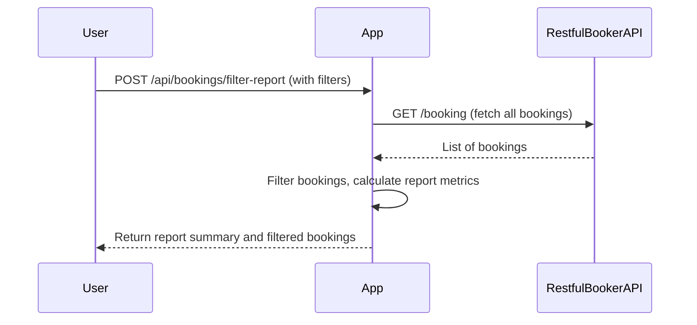
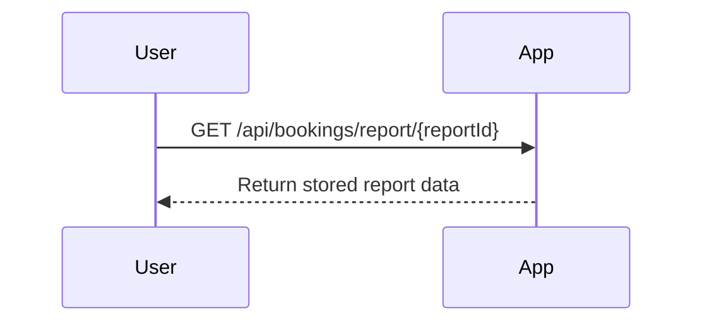

```markdown
# Functional Requirements for Booking Reports Application

## API Endpoints

### 1. POST /api/bookings/filter-report
- **Description:**  
  Fetch all bookings from the Restful Booker API, apply filters based on criteria such as booking dates, total price, and deposit paid status. Calculate report metrics including total revenue, average booking price, and number of bookings within specified date ranges. Return the summarized report data along with the filtered bookings.

- **Request Body:**
```json
{
  "dateFrom": "2023-01-01",           // optional, ISO 8601 date string
  "dateTo": "2023-12-31",             // optional, ISO 8601 date string
  "minTotalPrice": 100,               // optional, minimum total price filter
  "maxTotalPrice": 1000,              // optional, maximum total price filter
  "depositPaid": true                 // optional, filter by deposit paid status (true/false)
}
```

- **Response Body:**
```json
{
  "totalBookings": 123,
  "totalRevenue": 45678.90,
  "averageBookingPrice": 371.19,
  "bookingsWithinDateRange": 100,
  "bookings": [
    {
      "bookingId": 1,
      "firstname": "John",
      "lastname": "Doe",
      "totalPrice": 350,
      "depositPaid": true,
      "bookingDates": {
        "checkin": "2023-05-01",
        "checkout": "2023-05-10"
      }
    }
    // ... additional bookings
  ]
}
```

---

### 2. GET /api/bookings/report/{reportId}
- **Description:**  
  Retrieve a previously generated report by its unique identifier. (Optional: if reports are cached or stored)

- **Response Body:**  
  Same format as the POST `/api/bookings/filter-report` response.

---

## Business Logic Summary

- The **POST /api/bookings/filter-report** endpoint will:  
  1. Call the external Restful Booker API to retrieve all bookings.  
  2. Apply filtering logic based on the given request parameters.  
  3. Calculate aggregated report metrics: total revenue, average booking price, and count of bookings in date ranges.  
  4. Return both the aggregated metrics and filtered list of bookings.

- The **GET /api/bookings/report/{reportId}** endpoint will:  
  Retrieve and return stored reports by ID (optional feature for caching or saved reports).

---

## User-App Interaction Sequence



---

## Optional Report Retrieval Flow


```