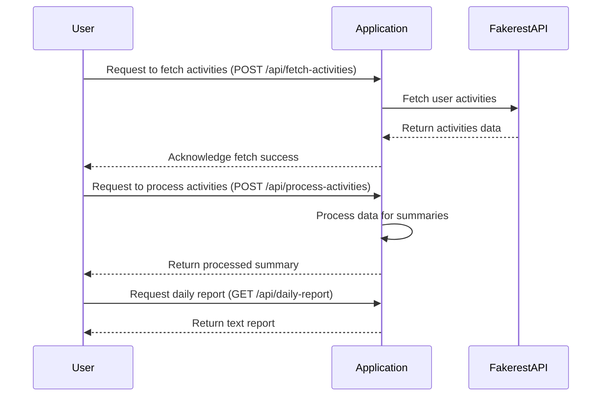

# Final Functional Requirements for Activity Tracker Application

## API Endpoints

### 1. Fetch User Activities
- **Endpoint**: `/api/fetch-activities`
- **Method**: `POST`
- **Description**: Fetches all user activities from the Fakerest API without filtering.
- **Request Format**:
  ```json
  {
    "startDate": "YYYY-MM-DD",
    "endDate": "YYYY-MM-DD"
  }
  ```
- **Response Format**:
  ```json
  {
    "status": "success",
    "data": [
      {
        "userId": "1",
        "activity": "Activity Name",
        "timestamp": "YYYY-MM-DDTHH:MM:SSZ"
      }
    ]
  }
  ```

### 2. Process Activity Data
- **Endpoint**: `/api/process-activities`
- **Method**: `POST`
- **Description**: Processes the fetched data to generate both overall counts and frequency of activities per user.
- **Request Format**:
  ```json
  {
    "activities": [
      {
        "userId": "1",
        "activity": "Activity Name",
        "timestamp": "YYYY-MM-DDTHH:MM:SSZ"
      }
    ]
  }
  ```
- **Response Format**:
  ```json
  {
    "status": "success",
    "summary": {
      "totalActivities": 100,
      "frequentActivities": [
        {
          "activity": "Activity Name",
          "count": 10
        }
      ]
    }
  }
  ```

### 3. Get Daily Report
- **Endpoint**: `/api/daily-report`
- **Method**: `GET`
- **Description**: Retrieves the daily report as a simple text email including a brief header with the date of the report.
- **Response Format**:
  ```json
  {
    "status": "success",
    "report": "Daily report text..."
  }
  ```

## User-App Interaction Diagram



This finalized version captures the requirements as confirmed by you, ensuring clarity and alignment for development.