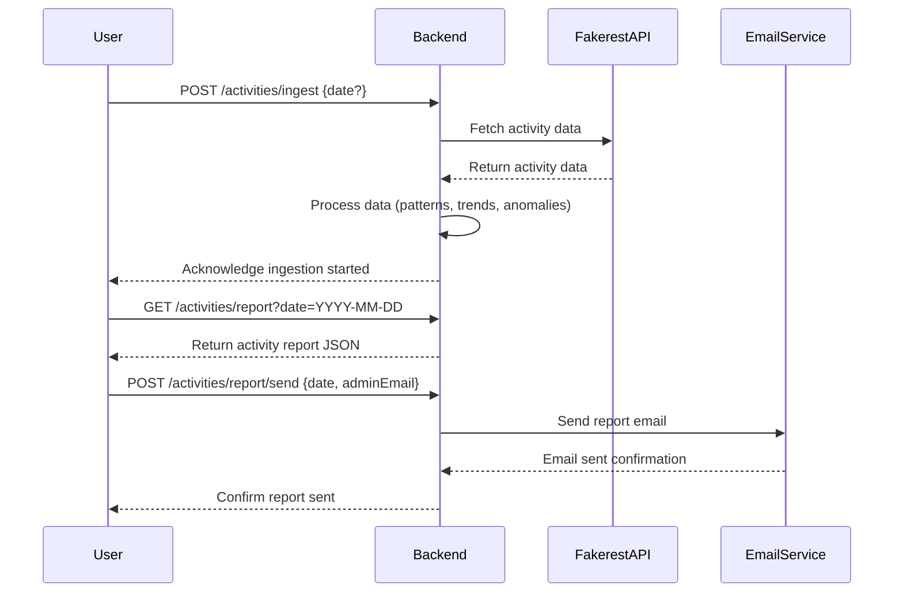

```markdown
# Functional Requirements and API Design for Activity Tracker Application

## API Endpoints

### 1. POST `/activities/ingest`
- **Description:** Trigger data ingestion from the Fakerest API and process the data.
- **Request Body:**  
  ```json
  {
    "date": "YYYY-MM-DD"  // Optional: date for which to ingest data, defaults to current day
  }
  ```
- **Response:**  
  ```json
  {
    "status": "success",
    "message": "Data ingestion and processing started for date YYYY-MM-DD"
  }
  ```

### 2. GET `/activities/report`
- **Description:** Retrieve the daily activity report for a specific date.
- **Query Parameters:**  
  - `date` (required): Date of the report in `YYYY-MM-DD` format.
- **Response:**  
  ```json
  {
    "date": "YYYY-MM-DD",
    "totalActivities": 100,
    "activityTypes": {
      "typeA": 50,
      "typeB": 30,
      "typeC": 20
    },
    "trends": {
      "mostActiveUser": "user123",
      "peakActivityHour": "15:00"
    },
    "anomalies": [
      "User456 showed unusually high activity"
    ]
  }
  ```

### 3. POST `/activities/report/send`
- **Description:** Trigger sending the daily report email to the admin.
- **Request Body:**  
  ```json
  {
    "date": "YYYY-MM-DD",
    "adminEmail": "admin@example.com"
  }
  ```
- **Response:**  
  ```json
  {
    "status": "success",
    "message": "Report for YYYY-MM-DD sent to admin@example.com"
  }
  ```

---

## Business Logic Summary
- **POST `/activities/ingest`** fetches user activity data from Fakerest API, processes it (pattern analysis, trend and anomaly detection), and stores results.
- **GET `/activities/report`** retrieves processed report data for the requested date.
- **POST `/activities/report/send`** formats and sends the report via email to the admin.

---

## User-App Interaction Sequence (Mermaid Diagram)


```