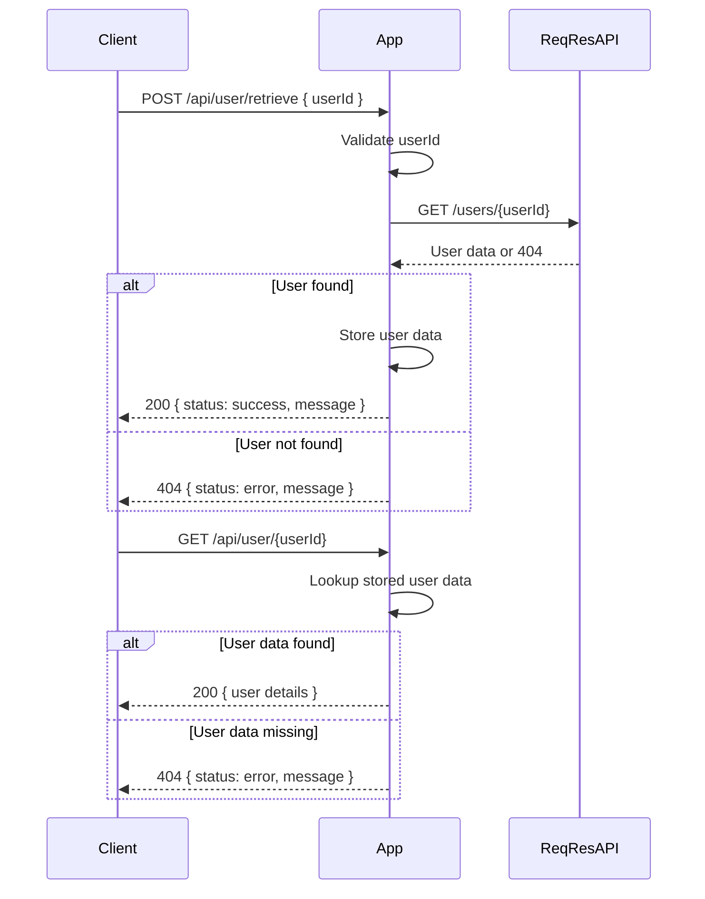

```markdown
# Functional Requirements for User Details Retrieval Application

## API Endpoints

### 1. POST /api/user/retrieve
- **Purpose:** Trigger retrieval of user details from the external ReqRes API using provided user ID.
- **Request Body:**
  ```json
  {
    "userId": 2
  }
  ```
- **Behavior:**
  - Validate the userId (must be positive integer).
  - Call ReqRes API `GET /users/{id}`.
  - Store or cache the retrieved user details internally for later retrieval.
  - Handle errors for invalid userId or user not found.
- **Response:**
  - Success (HTTP 200):
    ```json
    {
      "status": "success",
      "message": "User data retrieved and stored"
    }
    ```
  - Failure (HTTP 400 or 404):
    ```json
    {
      "status": "error",
      "message": "User not found"
    }
    ```

---

### 2. GET /api/user/{userId}
- **Purpose:** Retrieve the stored user details previously fetched.
- **Request Parameters:**
  - `userId` (path param): The user ID whose details are requested.
- **Response:**
  - Success (HTTP 200):
    ```json
    {
      "id": 2,
      "email": "janet.weaver@reqres.in",
      "first_name": "Janet",
      "last_name": "Weaver",
      "avatar": "https://reqres.in/img/faces/2-image.jpg"
    }
    ```
  - Failure (HTTP 404):
    ```json
    {
      "status": "error",
      "message": "User data not found. Please retrieve it first."
    }
    ```

---

## User-App Interaction Sequence Diagram


```