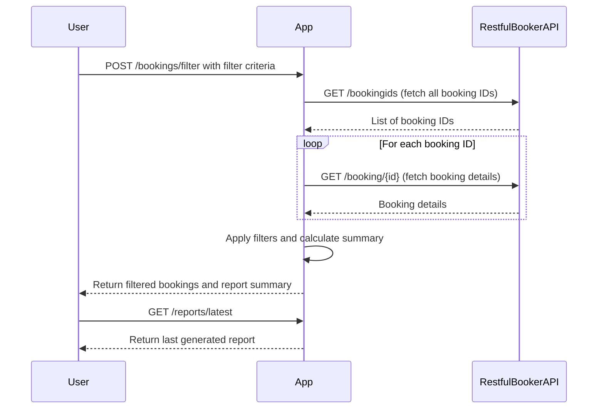

```markdown
# Functional Requirements and API Design

## API Endpoints

### 1. `POST /bookings/filter`
- **Description:** Retrieve bookings from Restful Booker API, apply filtering and calculations, and generate report data.
- **Request Body:**
```json
{
  "filters": {
    "checkinDateFrom": "YYYY-MM-DD",   // optional
    "checkinDateTo": "YYYY-MM-DD",     // optional
    "totalPriceMin": 0,                 // optional
    "totalPriceMax": 1000,              // optional
    "depositPaid": true                 // optional
  },
  "reportDateRanges": [                // optional, for summary reports
    {
      "from": "YYYY-MM-DD",
      "to": "YYYY-MM-DD"
    }
  ]
}
```
- **Response Body:**
```json
{
  "filteredBookings": [
    {
      "bookingId": 1,
      "firstName": "John",
      "lastName": "Doe",
      "totalPrice": 150,
      "depositPaid": true,
      "bookingDates": {
        "checkin": "2023-04-01",
        "checkout": "2023-04-05"
      }
    }
  ],
  "summary": {
    "totalRevenue": 12345.67,
    "averageBookingPrice": 234.56,
    "bookingsCountByDateRange": [
      {
        "from": "2023-01-01",
        "to": "2023-01-31",
        "count": 10
      }
    ]
  }
}
```

---

### 2. `GET /reports/latest`
- **Description:** Retrieve the latest generated report data.
- **Response Body:** Same as the response body of `POST /bookings/filter`.

---

## Business Logic Notes:
- The `POST /bookings/filter` endpoint will:
  - Fetch all bookings from the Restful Booker API
  - Apply filters as per input criteria (date ranges, price range, deposit status)
  - Calculate summary statistics (total revenue, average price, count per date range)
  - Store the result internally for later retrieval
- The `GET /reports/latest` endpoint will:
  - Return the last generated report without re-fetching external data

---

## User-App Interaction Sequence


```