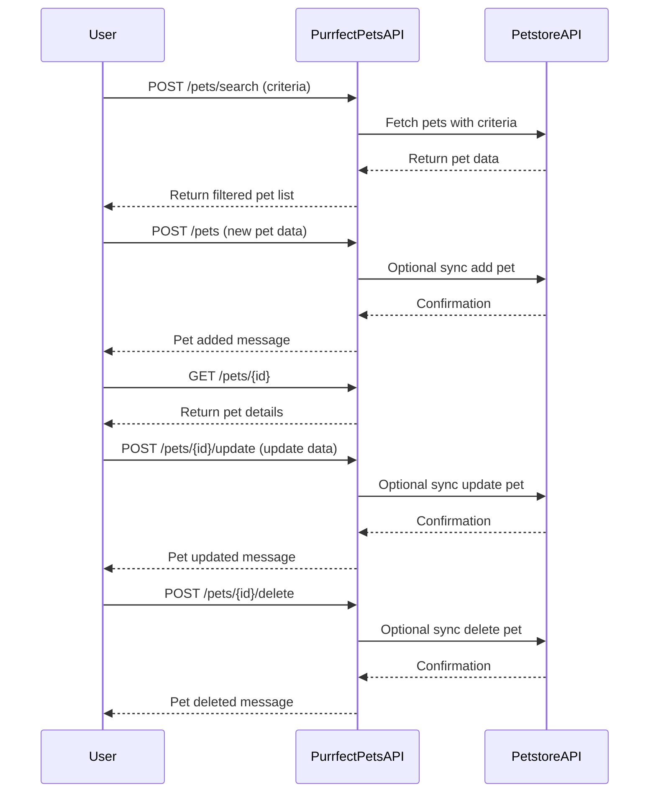

```markdown
# Functional Requirements for 'Purrfect Pets' API

## API Endpoints

### 1. Search Pets (POST)
- **URL:** `/pets/search`
- **Description:** Receives search criteria, invokes Petstore API to retrieve matching pets, processes data, and returns results.
- **Request Body (JSON):**
  ```json
  {
    "type": "string",       // optional, e.g., "dog", "cat"
    "status": "string",     // optional, e.g., "available", "sold"
    "tags": ["string"]      // optional list of tags to filter
  }
  ```
- **Response Body (JSON):**
  ```json
  {
    "pets": [
      {
        "id": "number",
        "name": "string",
        "type": "string",
        "status": "string",
        "tags": ["string"]
      }
    ]
  }
  ```

### 2. Add New Pet (POST)
- **URL:** `/pets`
- **Description:** Adds a new pet to the local store and optionally syncs with Petstore API.
- **Request Body (JSON):**
  ```json
  {
    "name": "string",
    "type": "string",
    "status": "string",
    "tags": ["string"]
  }
  ```
- **Response Body (JSON):**
  ```json
  {
    "id": "number",
    "message": "Pet added successfully"
  }
  ```

### 3. Get Pet Details (GET)
- **URL:** `/pets/{id}`
- **Description:** Retrieves pet details by ID from local store.
- **Response Body (JSON):**
  ```json
  {
    "id": "number",
    "name": "string",
    "type": "string",
    "status": "string",
    "tags": ["string"]
  }
  ```

### 4. Update Pet (POST)
- **URL:** `/pets/{id}/update`
- **Description:** Updates pet details and optionally syncs with Petstore API.
- **Request Body (JSON):**
  ```json
  {
    "name": "string",       // optional
    "type": "string",       // optional
    "status": "string",     // optional
    "tags": ["string"]      // optional
  }
  ```
- **Response Body (JSON):**
  ```json
  {
    "message": "Pet updated successfully"
  }
  ```

### 5. Delete Pet (POST)
- **URL:** `/pets/{id}/delete`
- **Description:** Deletes a pet from local store and optionally from Petstore API.
- **Response Body (JSON):**
  ```json
  {
    "message": "Pet deleted successfully"
  }
  ```

---

## User-App Interaction Sequence Diagram



---

## Summary

- Use POST endpoints for any action involving external data retrieval or modification.
- Use GET only for retrieving stored data without external calls.
- Request and response bodies use JSON format.
- Optional synchronization with Petstore API on add/update/delete operations.
```