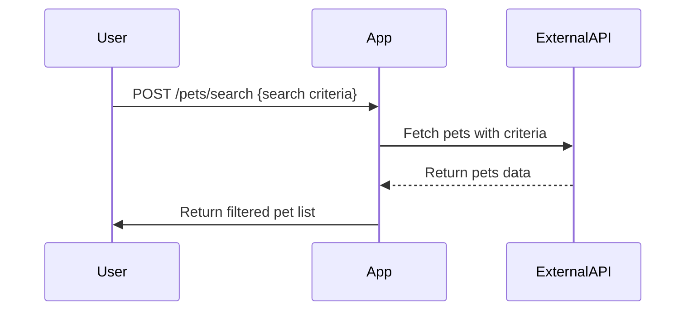
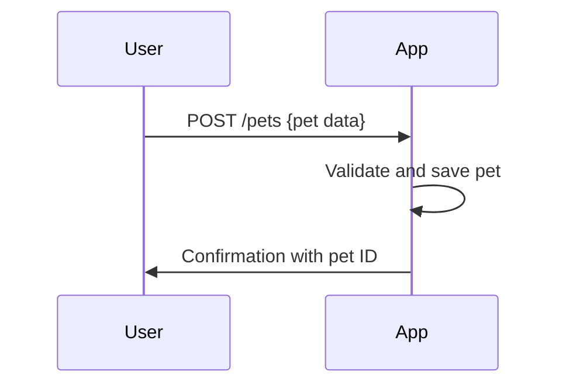
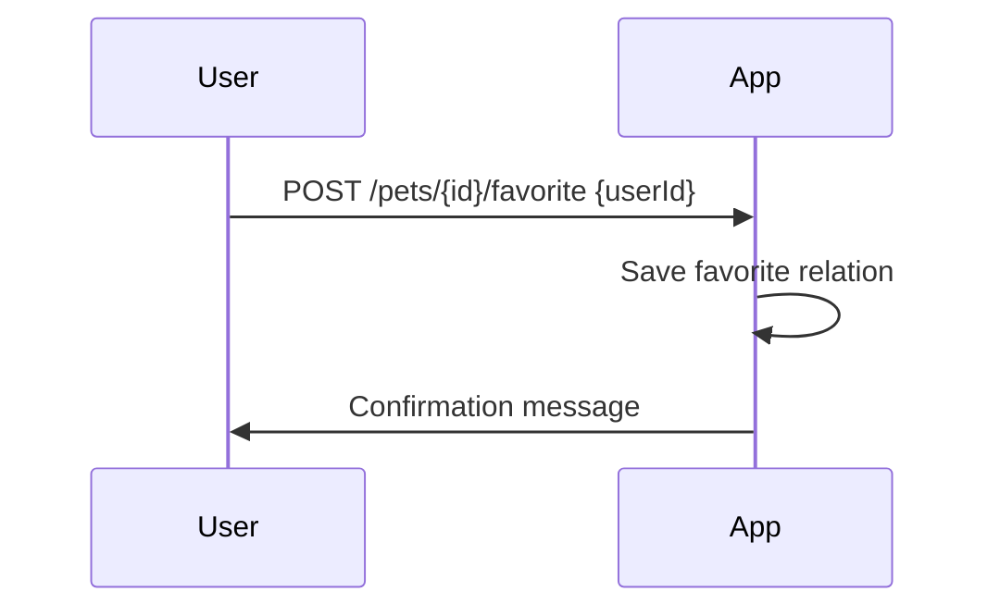

```markdown
# Functional Requirements for Purrfect Pets API

## API Endpoints

### 1. Search Pets (POST)  
**Endpoint:** `/pets/search`  
**Description:** Accepts search criteria, fetches pet data from external Petstore API, filters or processes data, and returns results.  
**Request:**  
```json
{
  "status": "available",              // optional: available, pending, sold
  "category": "cats",                 // optional
  "nameContains": "fluffy"            // optional partial name match
}
```  
**Response:**  
```json
{
  "pets": [
    {
      "id": 123,
      "name": "Fluffy",
      "category": "cats",
      "status": "available",
      "photoUrls": ["url1", "url2"]
    }
  ]
}
```

### 2. Add New Pet (POST)  
**Endpoint:** `/pets`  
**Description:** Adds a new pet to the system (persisted locally or via external API).  
**Request:**  
```json
{
  "name": "Whiskers",
  "category": "cats",
  "status": "available",
  "photoUrls": ["url1", "url2"]
}
```  
**Response:**  
```json
{
  "id": 124,
  "message": "Pet added successfully"
}
```

### 3. Get Pet Details (GET)  
**Endpoint:** `/pets/{id}`  
**Description:** Retrieves details of a pet by ID from local data.  
**Response:**  
```json
{
  "id": 124,
  "name": "Whiskers",
  "category": "cats",
  "status": "available",
  "photoUrls": ["url1", "url2"]
}
```

### 4. Mark Pet as Favorite (POST)  
**Endpoint:** `/pets/{id}/favorite`  
**Description:** Marks a pet as favorite for the user.  
**Request:**  
```json
{
  "userId": 567
}
```  
**Response:**  
```json
{
  "message": "Pet marked as favorite"
}
```

---

## Mermaid Diagrams

### User Search and Retrieve Pets



### User Adds New Pet



### User Marks Pet as Favorite


```