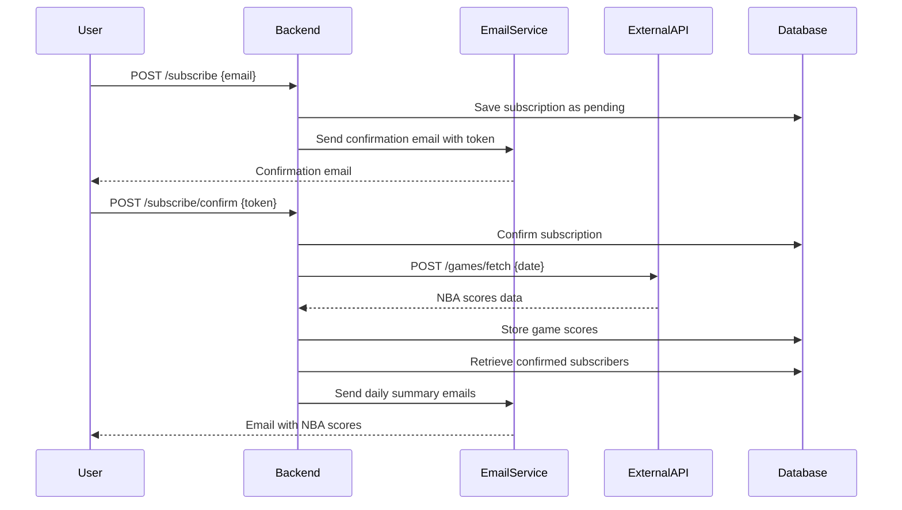
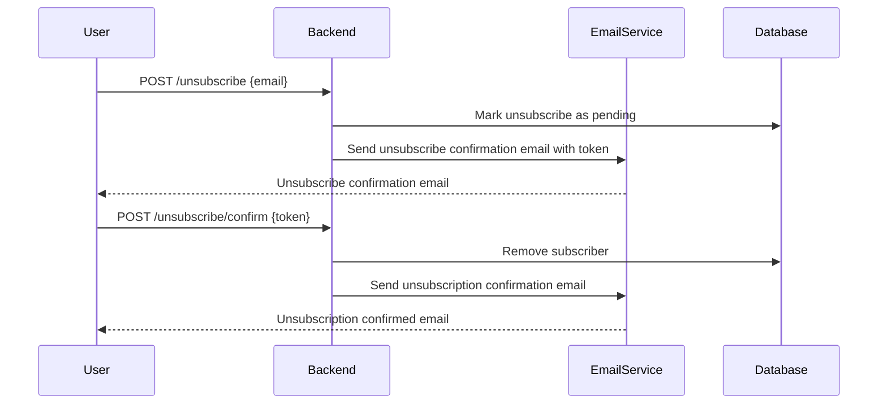
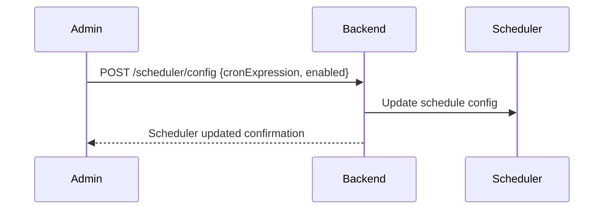

```markdown
# Functional Requirements and API Specification

## API Endpoints

### 1. Subscribe to Notifications  
**POST** `/subscribe`  
- Purpose: Register a new subscriber email and send confirmation email.  
- Request Body:  
```json
{
  "email": "user@example.com"
}
```  
- Response:  
```json
{
  "message": "Subscription request received. Please confirm via email."
}
```
- Validates email format and rejects duplicates.

### 2. Confirm Subscription  
**POST** `/subscribe/confirm`  
- Purpose: Confirm subscription using a token sent by email.  
- Request Body:  
```json
{
  "token": "confirmation-token"
}
```  
- Response:  
```json
{
  "message": "Subscription confirmed."
}
```

### 3. Unsubscribe  
**POST** `/unsubscribe`  
- Purpose: Request to unsubscribe an email and send confirmation email.  
- Request Body:  
```json
{
  "email": "user@example.com"
}
```  
- Response:  
```json
{
  "message": "Unsubscribe request received. Please confirm via email."
}
```
- No authentication required; only email is needed.

### 4. Confirm Unsubscription  
**POST** `/unsubscribe/confirm`  
- Purpose: Confirm unsubscription using a token sent by email.  
- Request Body:  
```json
{
  "token": "unsubscribe-token"
}
```  
- Response:  
```json
{
  "message": "Unsubscription confirmed."
}
```

### 5. Get Subscribers  
**GET** `/subscribers`  
- Purpose: Retrieve paginated list of confirmed subscribers.  
- Query Parameters:  
  - `page` (optional, default 0)  
  - `size` (optional, default 20)  
- Response:  
```json
{
  "page": 0,
  "size": 20,
  "totalPages": 5,
  "totalSubscribers": 100,
  "subscribers": [
    "user1@example.com",
    "user2@example.com"
  ]
}
```

### 6. Fetch and Store NBA Scores  
**POST** `/games/fetch`  
- Purpose: Trigger fetching daily NBA scores from external API, store them locally, and send notifications.  
- Request Body:  
```json
{
  "date": "YYYY-MM-DD"
}
```  
- Response:  
```json
{
  "message": "Scores fetched and notifications sent for 2025-03-25."
}
```

### 7. Get Games by Date  
**GET** `/games/{date}`  
- Purpose: Retrieve all stored NBA games for a specific date.  
- Path Parameter:  
  - `date` in `YYYY-MM-DD` format  
- Response:  
```json
[
  {
    "gameId": "1234",
    "date": "2025-03-25",
    "homeTeam": "Lakers",
    "awayTeam": "Warriors",
    "homeScore": 110,
    "awayScore": 105,
    "status": "Final"
  }
]
```
- Returns all games for the date without pagination.

### 8. Scheduler Configuration  
**POST** `/scheduler/config`  
- Purpose: Update scheduler time and enable/disable status via API.  
- Request Body:  
```json
{
  "cronExpression": "0 0 18 * * ?", 
  "enabled": true
}
```  
- Response:  
```json
{
  "message": "Scheduler updated."
}
```

---

## Mermaid Sequence Diagram: User Subscription and Notification Flow



## Mermaid Sequence Diagram: Unsubscribe Flow



## Mermaid Sequence Diagram: Scheduler Config Update


```